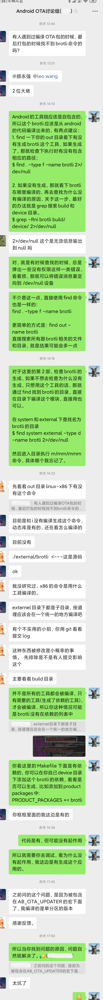

# 程序查错实战："找不到xxx"一类错误的处理思路


> Photo by Markus Winkler on Unsplash
>
> 本文原创发布于微信公众号“洛奇看世界”。

[TOC]

## 1. 背景

本文围绕Android OTA群小伙伴反馈的问题，“编译Android打包时找不到brotli命令”这个问题展开分析，演示解决这个问题的思路和处理过程。


> 声明：本文的调试经验不适合经验丰富的资深油条们~

“找不到xxx文件”是一类非常常见的错误，在编译代码或执行程序时爆出，通常的错误信息就是找不到文件/命令，或命令执行失败。

对这一类”找不到xxx"或“xxx执行失败"问题的排错是有规律的，所以本文围绕群里小伙伴反馈的问题，“编译Android打包时找不到brotli命令”这个错误展开分析，演示解决这个问题的思路和处理过程。但本文不仅仅是解决小伙伴提出的这个问题本身，更提供解决这一类问题的通用思路。

## 2. 无从下手的原因

对有经验的老油条来说，这个问题会很简单，但对一些刚毕业或工作时间较短的朋友们来说，可能会觉得无从下手。

根据我自己过往的经验(谁还不是从没啥经验摸索过来的啊~)，无从下手，可能有类似这样的原因:

1. 刚接触Android，对Android编译系统不熟悉；
2. 以前从来没有用过brotli命令，不知道这个命名是做什么的；
3. 不清楚代码中调用brotli命令来做什么；

这里常常有一个心里活动，就是这一切对我来说都是未知的，一种面对未知的恐惧潜藏在心底，所以会有感觉搞不定的自我暗示，因为不了解。

回到之前谈过的，[程序出错了，第一件事要做什么？](20210703-程序出错了，第一件事要做什么？.md)，虽然Android不熟悉，虽然brotli不熟悉，但出错的具体信息可能很熟悉。
这里我没有让小伙伴贴出错误信息，但从他的描述看，”找不到brotli命令"，有没有觉得这样的错误很熟悉，类似的错误还有：
- "No such file or directory"
- "No such command"
- "Execute xxx failed, can't find xxx"
- "No permissions"

所以，系统再陌生，再复杂，但出现的错误可能是熟悉的。

实际上，调试问题棘手的不是出错，棘手的是错了错误却没有错误信息(比如突然duang~ segmentation fault了)，更棘手的是感觉有些地方不对劲，但系统并没有出错(各种启动和运行的性能问题)。

这就好像你老板不喜欢你，说你xxx做得不好一样，这其实是比较好的情况，因为知道了原因你还可以改进。坏的情况就是，老板说你工作做得不好，你问哪里做得不好，他就是不告诉你。更惨的是，感觉平时工作做得还行，你问老板你的工作怎样，他说还不错，做得挺好，但考勤时你总是垫底。你说咋整？

所以，困难的不是出现错误，困难的是出现错误以后没有反馈，或者无用的反馈。

## 3. 错误原因分析

回到问题，错误信息是"找不到brotli命令"，我们就来看看下一步要怎么办？

### 1. 检查brotli文件

第一步当然是核实看到底有没有brotli这个东西，如果有，那在哪里？

如果你非要问我为什么要再去核实有没有brotli？因为错误信息明明白白说了“找不到brotli命令"，那就是没有啊。我只想说，之所以第一步要去核实，那时因为常常会有意外，来到错误的原点，先检查一下错误，会大大减少意外的发生。没有啥，血和泪的经历，当你经历了足够多错误的时候就明白了。

确认一个文件是否存在，find命令就该出场了，因为Android系统是自包含的，基本上所有的工具和命令都包含在自己的代码包里，然后在编译时统一输出到out目录，所以尝试在out目录中查找下brotli:
```shell
$ find out -type f -name brotli 2>/dev/null
out/target/product/jasper/obj/PACKAGING/otatools_intermediates/otatools/bin/brotli
out/soong/host/linux-x86/bin/brotli
out/soong/.intermediates/external/brotli/brotli/linux_glibc_x86_64/brotli
out/host/linux-x86/bin/brotli
out/host/linux-x86/obj/EXECUTABLES/brotli_intermediates/brotli
```

接下来根据find的结果决定第二步的操作:
- 如果找到了，问题就变成为什么找不到这个已经存在的brotli文件？下一步检查编译脚本的运行环境。
- 如果没找到，问题就变成为什么没有生成brotli? 下一步检查编译的设置。

小伙伴反应的是，brotli相关的动态库有，但没有生成brotli命令本身。

所以，接下来就应该找到brotli的源码目录，检查brotli的编译。以前没有了解过brotli？哪里去找brotli的代码呢？根据惯例，Android的一些工具源码什么的通常放在system或external目录下，那就在这两个目录中搜索名为brotli的目录。此时find命令再次上场:
```shell
$ find system external -type d -name brotli 2>/dev/null
external/brotli
external/brotli/csharp/org/brotli
external/brotli/java/org/brotli
external/brotli/c/include/brotli
external/apache-commons-compress/src/test/java/org/apache/commons/compress/compressors/brotli
external/apache-commons-compress/src/main/java/org/apache/commons/compress/compressors/brotli
```

> 需要改进的是，brotli工具的源码目录不一定刚好叫brotli，所以搜索**名字包含brotli的目录**效果会更好:
> ```shell
> find system external -type d -name "*brotli*" 2>/dev/null
> ```

### 2. 检查brotli的生成

很显然，这里"external/brotli"就是brotli的源码目录，找到了我们就打开对应的Android.bp文件看下吧:
```
external/brotli$ cat Android.bp
// Copyright (C) 2017 The Android Open Source Project
//
// Licensed under the Apache License, Version 2.0 (the "License");
// you may not use this file except in compliance with the License.
// You may obtain a copy of the License at
//
//      http://www.apache.org/licenses/LICENSE-2.0
//
// Unless required by applicable law or agreed to in writing, software
// distributed under the License is distributed on an "AS IS" BASIS,
// WITHOUT WARRANTIES OR CONDITIONS OF ANY KIND, either express or implied.
// See the License for the specific language governing permissions and
// limitations under the License.
//

cc_library {
    name: "libbrotli",
    host_supported: true,
    recovery_available: true,
    cflags: [
        "-Werror",
        "-O2",
    ],
    export_include_dirs: ["c/include"],
    srcs: [
        "c/common/*.c",
        "c/dec/*.c",
        "c/enc/*.c",
    ],
    target: {
        linux_bionic: {
            enabled: true,
        },
    },
    stl: "none",
}

cc_binary {
    name: "brotli",
    host_supported: true,
    cflags: ["-Werror"],
    srcs: ["c/tools/brotli.c"],
    target: {
        linux_bionic: {
            enabled: true,
        },
    },
    shared_libs: ["libbrotli"],
}

//
// Support for brotli in java code.
//

java_library {
    name: "brotli-java",
    host_supported: true,
    hostdex: true,
    srcs: ["java/**/*.java"],
    exclude_srcs: ["java/**/*Test.java"],
    sdk_version: "current",
}
```

简而言之，这里的Android.bp总共做了3件事：
1. 生成名为libbrotli的库文件;
2. 生成名为brotli的可执行文件;
3. 生成名为brotli-java的java库文件;

从Android.bp的内容组织上看，这三个目标应该是一样的，理论上生成libbrotli库文件和brotli的可执行文件是一样的。所以，针对当下只有库文件，而没有生成可执行文件的问题很可能就是没有目标依赖于brotli文件。

> 编译时，Make系统解析Makefile，根据最终的目标生成一个依赖的关系链，只有在这个关系链中的目标文件才会生成，如果不在这个依赖的关系链中的文件则不会生成。

所以，问题就变成了为什么没有形成对brotli文件的依赖。

### 3. 检查brotli的依赖

此时轮到grep出场了，搜索Android编译系统中对brotli目标的依赖，由于Android的编译核心在build目录，各厂家的编译位于device下，所以就搜索build和device目录:
```shell
$ grep -Rniw brotli build device 2>/dev/null
build/make/core/Makefile:3642:  $(BROTLI) \
build/make/core/Makefile:4322:$(INTERNAL_OTA_PACKAGE_TARGET): $(BROTLI)
build/make/core/Makefile:4349:$(INTERNAL_OTA_RETROFIT_DYNAMIC_PARTITIONS_PACKAGE_TARGET): $(BROTLI)
build/make/core/config.mk:554:BROTLI := $(HOST_OUT_EXECUTABLES)/brotli$(HOST_EXECUTABLE_SUFFIX)
build/make/tools/releasetools/common.py:2089:    # For full OTA, compress the new.dat with brotli with quality 6 to reduce
build/make/tools/releasetools/common.py:2092:    #                       zip  | brotli(quality 6)  | brotli(quality 9)
build/make/tools/releasetools/common.py:2098:      brotli_cmd = ['brotli', '--quality=6',
build/make/tools/releasetools/common.py:2101:      print("Compressing {}.new.dat with brotli".format(self.partition))
Binary file build/make/.git/objects/pack/pack-ba4cf1d4e8f9858402b36f3b4c1ee45baf454da9.pack matches
build/core/Makefile:3642:  $(BROTLI) \
build/core/Makefile:4322:$(INTERNAL_OTA_PACKAGE_TARGET): $(BROTLI)
build/core/Makefile:4349:$(INTERNAL_OTA_RETROFIT_DYNAMIC_PARTITIONS_PACKAGE_TARGET): $(BROTLI)
build/core/config.mk:554:BROTLI := $(HOST_OUT_EXECUTABLES)/brotli$(HOST_EXECUTABLE_SUFFIX)
build/tools/releasetools/common.py:2089:    # For full OTA, compress the new.dat with brotli with quality 6 to reduce
build/tools/releasetools/common.py:2092:    #                       zip  | brotli(quality 6)  | brotli(quality 9)
build/tools/releasetools/common.py:2098:      brotli_cmd = ['brotli', '--quality=6',
build/tools/releasetools/common.py:2101:      print("Compressing {}.new.dat with brotli".format(self.partition))
```

从上面搜索结果的第二行可见：
```shell
build/make/core/Makefile:4322:$(INTERNAL_OTA_PACKAGE_TARGET): $(BROTLI)
```

目标`$(INTERNAL_OTA_PACKAGE_TARGET)`会依赖`$(BROTLI)`，如果需要生成`$(INTERNAL_OTA_PACKAGE_TARGET)`目标，那必定会生成`$(BROTLI)`。接下来就是通过调试Makefile去验证这个依赖。

最后，经过小伙伴调试后，结论是：
!(编译目标错误)[images-20210713/2-解决反馈.png]

至此，找到了问题的原因，要如何解决问题就很清楚了。

> 建议: 向别人请教问题时，在查明原因后，最好能给对方一个反馈信息，有始有终。

## 4. 回顾解决过程

回顾下前面解决这个问题的步骤：
1. 出现错误，找不到brotli命令;
2. 使用find确认是否真的没有brotli文件，根据不同的结果拟定下一步的操作;
3. 第2步没有生成brotli文件，查看Makefile，为什么没有生成brotli文件;
4. 使用grep检查brotli的依赖;
5. 通过调试Makefile，发现编译目标不一样，导致没有生成brotli的依赖;

这里用到的主要知识就是find和grep工具的使用，以及Android目录结构和Makefile的依赖原理。通过具体的错误信息，一步一步往下跟踪，直到找到根本原因。

前面“无从下手的原因”里面提到的几种情况，在我们解决问题的过程中都没有成为障碍，所以很多时候的担心都是多余的，唯一要做的就是努力克服内心的恐惧。

问题解决了，好歹也得了解下brotli到底是干嘛的，Wiki上是这么介绍的:
> Brotli是一个Jyrki Alakuijala和Zoltán Szabadka开发的开源数据压缩程序库。Brotli基于LZ77算法的一个现代变>体、霍夫曼编码和二阶上下文建模。
> 在Chrome、Opera和Firefox中，它已被用于加速万维网的传输速度。类似Google的压缩算法zopfli，brotli这个名字来自瑞士的烘培产品brötli。
> 来自维基百科: https://zh.wikipedia.org/wiki/Brotli

附上原来的微信聊天截图。

从微信截图中可以看到，另外一个小伙伴 @leo.wang 检查问题出发点的思路和我是一样的，先检查文件，然后检查相应的代码模块，确认是否编译了。

## 5. 衍生问题

最后，问题来了：
1. 如果检查发现brotli文件已经生成了，下一步要如何操作？
2. 如果Android的工具不是自包含的，下一步又要如何操作？
3. 如果问题不是"找不到brotli命令"，而是一个"No permissions"，这种问题又要如何解决？

## 6. 相关文章


