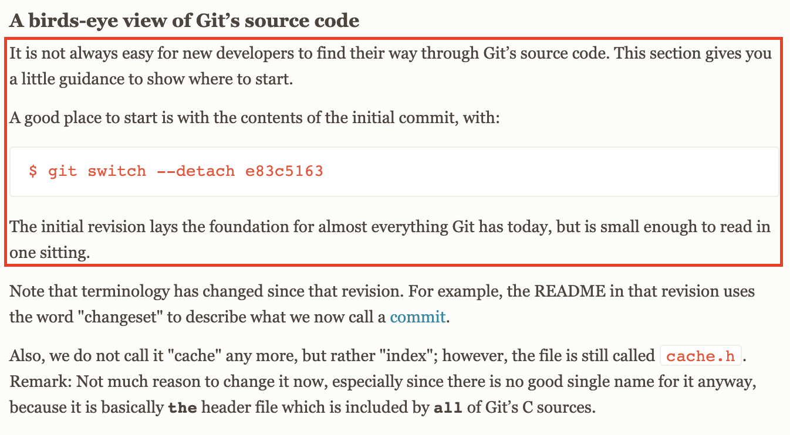

# 基于git第一版的源码分析

[TOC]

## 1. 综述

学习Git，有很多不错的图书和资料，我通常比较推荐以下资料:
1. 蒋鑫的《Git权威指南》，这本书虽然有点厚，但讲了GIT的方方面面(一句话说不完)，是目前我读过的最全面介绍git的书，适合作为案头常备的参考读物。
2. Git官方推荐的图书 《Pro Git》，现在在线也可以阅读该书的中文版: [Pro Git](https://git-scm.com/book/zh/v2)
3. Git官方文档 [https://git-scm.com/docs](https://git-scm.com/docs)，比较严肃，所以读起来会比较晦涩，需要有点耐心，但这个是Git命令最好的参考文档

> 目前《Git权威指南已经绝版》有需要电子书可加我个人微信，说明Git电子书，个人微信见公众号。

在Git官方文档的 User Manual 中介绍提到，如果你想阅读 Git 源码，早期的第一版是最好的出发点。

> 
> 来自: [A birds-eye view of Git’s source code](https://git-scm.com/docs/user-manual#birdview-on-the-source-code)

于是阅读了 Git 的第一版代码。

Git 第一版代码很简单, 算上 Makefile 和 README 文件一共才11个文件，按照[这篇文章](https://zhuanlan.zhihu.com/p/257084586)的说明，所有代码总计1089行，虽然代码很小，但已经具有了Git的原型。

这个版本代码编译后生成7个可执行文件，对应于7个命令，这些文件同现在命令的比较如下:


> 图片来自[这篇文章](https://zhuanlan.zhihu.com/p/257084586)

后面会演示如何下载，编译代码和运行，然后逐文件进行注释。

## 2. 下载和编译运行

```shell
# 下载代码
$ git clone https://github.com/git/git.git .

# 现在最开始的10个提交
$ git log --reverse --oneline | head -10
e83c516 Initial revision of "git", the information manager from hell
8bc9a0c Add copyright notices.
e497ea2 Make read-tree actually unpack the whole tree.
bf0c6e8 Make "cat-file" output the file contents to stdout.
19b2860 Use "-Wall -O2" for the compiler to get more warnings.
24778e3 Factor out "read_sha1_file" into mapping/inflating/unmapping.
2ade934 Add "check_sha1_signature()" helper function
2022211 Add first cut at "fsck-cache" that validates the SHA1 object store.
7660a18 Add new fsck-cache to Makefile.
9426167 Add "-lz" to link line to get in zlib.

# 基于第一个提交 e83c5163 生成分支 git-e83c5163, 并切换到该分支查看代码
$ git checkout -b git-e83c5163 e83c5163
```

为了编译代码, 还需要在Makefile中链接时添加 zlib 和 crypto 库的支持，如下:
```
LIBS= -lz -lssl -lcrypto
```

编译代码
```
make
```

## 3. 使用演示

以下是我使用编译生成的文件进行操作的演示:

```shell
# 初始化
$ ./init-db 
defaulting to private storage area

# 添加文件 Makefile (写入 blob 对象)
$ ./update-cache Makefile 
$ find .dircache -type f
.dircache/index
.dircache/objects/b0/4fb99b9a176ff05e03d5e6e739f0a82b83c56c

# 查看上一步写入的 Makefile blob 对象
$ ./cat-file b04fb99b9a176ff05e03d5e6e739f0a82b83c56c
temp_git_file_2MIyAT: blob
$ cat temp_git_file_2MIyAT

# 添加文件 README (写入 blob 对象)
$ ./update-cache README 
$ find .dircache -type f
.dircache/index
.dircache/objects/66/5025b11ce8fb16fadb7daebf77cb54a2ae39a1
.dircache/objects/b0/4fb99b9a176ff05e03d5e6e739f0a82b83c56c

# 将添加的 Makefile 和 README (写入 tree 对象)
$ ./write-tree 
261232a8e0ffbfb43a3bed535c3539d9647901f9

# 查看上一步写入的 tree 对象
$ ./cat-file 261232a8e0ffbfb43a3bed535c3539d9647901f9
temp_git_file_9CFutq: tree
$ cat temp_git_file_9CFutq

# 提交写入的 tree 对象, 第一次提交 (写入 commit 对象)
$ echo "First Commit!" | ./commit-tree 261232a8e0ffbfb43a3bed535c3539d9647901f9
Committing initial tree 261232a8e0ffbfb43a3bed535c3539d9647901f9
76f9697854a64d62f4a511ca09db3aa4879cdc10
$ find .dircache -type f
.dircache/index
.dircache/objects/76/f9697854a64d62f4a511ca09db3aa4879cdc10
.dircache/objects/66/5025b11ce8fb16fadb7daebf77cb54a2ae39a1
.dircache/objects/26/1232a8e0ffbfb43a3bed535c3539d9647901f9
.dircache/objects/b0/4fb99b9a176ff05e03d5e6e739f0a82b83c56c

# 查看上一步写入的 commit 对象
$ ./cat-file 76f9697854a64d62f4a511ca09db3aa4879cdc10
temp_git_file_0EabYS: commit
$ cat temp_git_file_0EabYS

# 修改 Makefile, 写入修改后的 blob 对象, 然后添加到 tree 对象中
$ vim Makefile
$ ./show-diff Makefile b04fb99b9a176ff05e03d5e6e739f0a82b83c56c
$ ./update-cache Makefile 
$ ./write-tree 
0cecb5da03708fd258e4d6b2019a78578e1c9152
$ find .dircache -type f
.dircache/index
.dircache/objects/76/f9697854a64d62f4a511ca09db3aa4879cdc10
.dircache/objects/0c/ecb5da03708fd258e4d6b2019a78578e1c9152
.dircache/objects/66/5025b11ce8fb16fadb7daebf77cb54a2ae39a1
.dircache/objects/7a/5eea9940bd3c11de39c4862767c623867c9374
.dircache/objects/26/1232a8e0ffbfb43a3bed535c3539d9647901f9
.dircache/objects/b0/4fb99b9a176ff05e03d5e6e739f0a82b83c56c

# 提交写入的 tree 对象, 第二次提交 (写入 commit 对象)
$ echo "Second Commit!" | ./commit-tree 0cecb5da03708fd258e4d6b2019a78578e1c9152 -p 76f9697854a64d62f4a511ca09db3aa4879cdc10
6d55fcb1945d84b22cd06c64bfab804ad4ded798
$ find .dircache -type f
.dircache/index
.dircache/objects/76/f9697854a64d62f4a511ca09db3aa4879cdc10
.dircache/objects/0c/ecb5da03708fd258e4d6b2019a78578e1c9152
.dircache/objects/66/5025b11ce8fb16fadb7daebf77cb54a2ae39a1
.dircache/objects/7a/5eea9940bd3c11de39c4862767c623867c9374
.dircache/objects/26/1232a8e0ffbfb43a3bed535c3539d9647901f9
.dircache/objects/6d/55fcb1945d84b22cd06c64bfab804ad4ded798
.dircache/objects/b0/4fb99b9a176ff05e03d5e6e739f0a82b83c56c

# 使用 cat-file 提取最后一次写入的 commit 对象
$ ./cat-file 6d55fcb1945d84b22cd06c64bfab804ad4ded798
temp_git_file_SU60Jd: commit
# 查看提取到的 commit 对象数据
$ cat temp_git_file_SU60Jd 
tree 0cecb5da03708fd258e4d6b2019a78578e1c9152
parent 76f9697854a64d62f4a511ca09db3aa4879cdc10
author guyongqiang,,, <ygu@guyongqiangx> Sat Jul 17 18:18:58 2021
committer guyongqiang,,, <ygu@guyongqiangx> Sat Jul 17 18:18:58 2021

Second Commit!
```

## 4. 逐行源码分析

### 4.1 文件`cache.h`

`cache.h`文件定义了版本库目录名称(".dircache/objects")和索引文件(".dircache/index")的格式，包括索引文件头部`struct cache_header`和索引文件记录`struct cache_entry`的数据结构。

另外包含了一些给各个模块公用的函数声明。


```c
#ifndef CACHE_H
#define CACHE_H

#include <stdio.h>
#include <sys/stat.h>
#include <fcntl.h>
#include <stddef.h>
#include <stdlib.h>
#include <stdarg.h>
#include <errno.h>
#include <sys/mman.h>

#include <openssl/sha.h>
#include <zlib.h>
#include <string.h> /* memcmp,memmove,memset,memcpy,strlen */

/*
 * Basic data structures for the directory cache
 *
 * NOTE NOTE NOTE! This is all in the native CPU byte format. It's
 * not even trying to be portable. It's trying to be efficient. It's
 * just a cache, after all.
 */

/* 暂存区文件(".dircache/index")头部格式 */
#define CACHE_SIGNATURE 0x44495243	/* "DIRC" */
struct cache_header {
	unsigned int signature;
	unsigned int version;
	unsigned int entries;
	unsigned char sha1[20];
};

/*
 * The "cache_time" is just the low 32 bits of the
 * time. It doesn't matter if it overflows - we only
 * check it for equality in the 32 bits we save.
 */
struct cache_time {
	unsigned int sec;
	unsigned int nsec;
};

/*
 * dev/ino/uid/gid/size are also just tracked to the low 32 bits
 * Again - this is just a (very strong in practice) heuristic that
 * the inode hasn't changed.
 */
/*
 * 暂存区文件(".dircache/index")内单条记录格式
 * 最后一个 name 成员是大小为0的数组(用作占位符, 具体依赖于名字长度),
 * 一条 cache entry 由前面定长的部分和最后变长的部分构成, 所以总体长度不是固定的
 */
struct cache_entry {
	/* 固定长度部分 */
	struct cache_time ctime;
	struct cache_time mtime;
	unsigned int st_dev;
	unsigned int st_ino;
	unsigned int st_mode;
	unsigned int st_uid;
	unsigned int st_gid;
	unsigned int st_size;
	unsigned char sha1[20];
	unsigned short namelen;
	/* 每条 cache entry 记录的 name 实际占用的长度由前面的 namelen 决定, 这里的 name[0] 就是一个大小为0的占位符 */
	unsigned char name[0];
};

/* 用于存储版本库目录路径, 默认为 ".dircache/objects", 实际没有使用, 每次都重新设置 */
const char *sha1_file_directory;
/* 内存中的 cache entry 缓存数组指针 */
struct cache_entry **active_cache = NULL;
/*
 *    active_nr: 为暂存区文件 ".dircache/index" 包含的实际 cache entry 数目
 * active_alloc: 为内存中可存放的 cache entry 数目(前面 cative_nr 部分已使用)
 */
unsigned int active_nr = 0, active_alloc = 0;

/*
 * 版本库目录的环境变量和默认名称, 当前git版本库目录已经改为".git/objects"了
 */
#define DB_ENVIRONMENT "SHA1_FILE_DIRECTORY"
#define DEFAULT_DB_ENVIRONMENT ".dircache/objects"

/*
 * 根据传入name字符串的长度len, 计算所在cache entry的大小(8字节对齐)
 */
#define cache_entry_size(len) ((offsetof(struct cache_entry,name) + (len) + 8) & ~7)
/*
 * 根据传入cache entry的记录, 计算cache entry的大小
 */
#define ce_size(ce) cache_entry_size((ce)->namelen)

#define alloc_nr(x) (((x)+16)*3/2)

/* Initialize the cache information */
/* 读取索引文件".dircache/index", 建立缓存, 返回条目数 */
extern int read_cache(void);

/* Return a statically allocated filename matching the sha1 signature */
/* 获取 sha1 值对应的文件名 */
extern char *sha1_file_name(unsigned char *sha1);

/* Write a memory buffer out to the sha file */
/* 将 buf 中大小为 size 的数据写入到 sha1 值对应的文件中 */
extern int write_sha1_buffer(unsigned char *sha1, void *buf, unsigned int size);

/* Read and unpack a sha1 file into memory, write memory to a sha1 file */
/* 提取 sha1 值对应文件的内容(解压缩后返回), 返回内容类型(blob/tree/commit)和 size */
extern void * read_sha1_file(unsigned char *sha1, char *type, unsigned long *size);
/* 压缩 buf 数据, 计算 sha1 值, 并写入对应的 sha1 文件中 */
extern int write_sha1_file(char *buf, unsigned len);

/* Convert to/from hex/sha1 representation */
/* 将 sha1 字符串转换成相应的 sha1 值 */
extern int get_sha1_hex(char *hex, unsigned char *sha1);
/* 将 sha1 值转换成相应的 sha1 字符串 */
extern char *sha1_to_hex(unsigned char *sha1);	/* static buffer! */

/* General helper functions */
extern void usage(const char *err);

#endif /* CACHE_H */
```

### 4.2 文件`read-cache.c`

`read-cache.c`文件定义了一些通用的函数, 包括 sha1 字符串和 sha1 数据的互转, 版本库中 sha1 文件的读写操作, 暂存区索引文件(".dircache/index")的读取操作。

```
#include "cache.h"

/*
 * read-cache.c 定义了各组件共用的函数
 */

/* 用于存储版本库目录路径, 默认为 ".dircache/objects", 实际没有使用, 每次都重新设置 */
const char *sha1_file_directory = NULL;
/* 内存中的 cache entry 缓存数组指针 */
struct cache_entry **active_cache = NULL;
/*
 *    active_nr: 为暂存区文件 ".dircache/index" 包含的实际 cache entry 数目
 * active_alloc: 为内存中可存放的 cache entry 数目(前面 cative_nr 部分已使用)
 */
unsigned int active_nr = 0, active_alloc = 0;

void usage(const char *err)
{
	fprintf(stderr, "read-tree: %s\n", err);
	exit(1);
}

/*
 * 将字符c[0-9a-fA-F]转换成对应的16进制数值
 */
static unsigned hexval(char c)
{
	if (c >= '0' && c <= '9')
		return c - '0';
	if (c >= 'a' && c <= 'f')
		return c - 'a' + 10;
	if (c >= 'A' && c <= 'F')
		return c - 'A' + 10;
	return ~0;
}

/*
 * 将 sha1 字符串转换成相应的 sha1 值
 * [hex]"91450428" --> [sha1]0x91,0x45,0x04,0x28
 */
int get_sha1_hex(char *hex, unsigned char *sha1)
{
	int i;
	for (i = 0; i < 20; i++) {
		/* 将相邻的两个 char 转换成一个 byte */
		unsigned int val = (hexval(hex[0]) << 4) | hexval(hex[1]);
		if (val & ~0xff)
			return -1;
		*sha1++ = val;
		hex += 2;
	}
	return 0;
}

/*
 * 将 sha1 值转换成相应的 sha1 字符串
 * [sha1]0x91,0x45,0x04,0x28 --> "91450428"
 */
char * sha1_to_hex(unsigned char *sha1)
{
	static char buffer[50];
	static const char hex[] = "0123456789abcdef";
	char *buf = buffer;
	int i;

	for (i = 0; i < 20; i++) {
		unsigned int val = *sha1++;
		*buf++ = hex[val >> 4];
		*buf++ = hex[val & 0xf];
	}
	return buffer;
}

/*
 * NOTE! This returns a statically allocated buffer, so you have to be
 * careful about using it. Do a "strdup()" if you need to save the
 * filename.
 */
/*
 * 返回 sha1 值对应的文件名
 * 如16进制数据: 914504285ab1fc2a7fca88dbf15f2b48a20b502d
 *   返回字符串: ".dircache/objects/91/4504285ab1fc2a7fca88dbf15f2b48a20b502d"
 */
char *sha1_file_name(unsigned char *sha1)
{
	int i;
	static char *name, *base;

	/* base 为 static 指针, 第一次分配并设置为 ".dircache/objects/__/________...________" 模式, 下次直接使用 */
	if (!base) {
		/*
		 * char *sha1_file_directory = getenv("SHA1_FILE_DIRECTORY") ? : ".dircache/objects";
		 * base = ".dircache/objects/__/________...________"
		 *                           |
		 *                           name
		 */
		char *sha1_file_directory = getenv(DB_ENVIRONMENT) ? : DEFAULT_DB_ENVIRONMENT;
		int len = strlen(sha1_file_directory);
		base = malloc(len + 60);
		memcpy(base, sha1_file_directory, len);
		memset(base+len, 0, 60);
		base[len] = '/';
		base[len+3] = '/';
		name = base + len + 1;
	}
	for (i = 0; i < 20; i++) {
		static char hex[] = "0123456789abcdef";
		unsigned int val = sha1[i];
		char *pos = name + i*2 + (i > 0); /* (i>0)用于调整文件名中的'/'字符带来的偏差 */
		*pos++ = hex[val >> 4];
		*pos = hex[val & 0xf];
	}
	return base;
}

/*
 * 返回 sha1 值对应的文件内容(解压缩后返回)
 */
void * read_sha1_file(unsigned char *sha1, char *type, unsigned long *size)
{
	z_stream stream;
	char buffer[8192];
	struct stat st;
	int i, fd, ret, bytes;
	void *map, *buf;
	/* 将 sha1 值转换成文件名 */
	char *filename = sha1_file_name(sha1);

	/* 打开文件 */
	fd = open(filename, O_RDONLY);
	if (fd < 0) {
		perror(filename);
		return NULL;
	}
	/* 获取文件大小 */
	if (fstat(fd, &st) < 0) {
		close(fd);
		return NULL;
	}
	/* 将文件映射到内存，方便访问 */
	map = mmap(NULL, st.st_size, PROT_READ, MAP_PRIVATE, fd, 0);
	close(fd);
	if (-1 == (int)(long)map)
		return NULL;

	/* Get the data stream */
	/* 初始化 zlib stream 结构体 */
	memset(&stream, 0, sizeof(stream));
	stream.next_in = map;
	stream.avail_in = st.st_size;
	stream.next_out = buffer;
	stream.avail_out = sizeof(buffer);

	inflateInit(&stream);
	ret = inflate(&stream, 0);
	/*
	 * 解压数据后, 解析提取头部数据到 type (blob/tree/commit) 和 size 中
	 * 原始数据的头部格式为: <ascii tag without space> + <space> + <ascii decimal size> + <byte\0> + <binary object data>
	 *                即: <type>                    + ' '     + <size>               + '\0'     + <binary data>
	 */
	if (sscanf(buffer, "%10s %lu", type, size) != 2)
		return NULL;
	bytes = strlen(buffer) + 1;
	/* 根据解析得到的 size (最终数据大小), 分配对应大小的 buf */
	buf = malloc(*size);
	if (!buf)
		return NULL;

	/* 复制第一次解压缩后, 头部后面的二进制数据到缓冲区 buf */
	memcpy(buf, buffer + bytes, stream.total_out - bytes);
	/* 设置 bytes 为已经解压缩得到的数据长度值 */
	bytes = stream.total_out - bytes;
	if (bytes < *size && ret == Z_OK) {
		stream.next_out = buf + bytes;
		stream.avail_out = *size - bytes;
		/* 解压剩余数据 */
		while (inflate(&stream, Z_FINISH) == Z_OK)
			/* nothing */;
	}
	/* 解压结束 */
	inflateEnd(&stream);
	return buf;
}

/*
 * 将 buf 数据写入到文件中
 * 1. 压缩 buf 数据;
 * 2. 计算压缩数据的 sha1 值;
 * 3. 将压缩后数据写入 sha1 值对应的文件中;
 */
int write_sha1_file(char *buf, unsigned len)
{
	int size;
	char *compressed;
	z_stream stream;
	unsigned char sha1[20];
	SHA_CTX c;

	/* 压缩传入的 buf 数据 */
	/* Set it up */
	memset(&stream, 0, sizeof(stream));
	deflateInit(&stream, Z_BEST_COMPRESSION);
	/* 根据初始化的算法和数据长度 len, 计算压缩后数据的上限, 实际得到的压缩数据不会超出这个上限 */
	size = deflateBound(&stream, len);
	compressed = malloc(size);

	/* Compress it */
	/* 设置 zlib stream 的输入输出输出数据指针 */
	stream.next_in = buf;
	stream.avail_in = len;
	stream.next_out = compressed;
	stream.avail_out = size;
	/* 压缩数据 */
	while (deflate(&stream, Z_FINISH) == Z_OK)
		/* nothing */;
	deflateEnd(&stream);
	/* 获取最终压缩后数据的大小 */
	size = stream.total_out;

	/* 计算压缩后数据的 sha1 值 */
	/* Sha1.. */
	SHA1_Init(&c);
	SHA1_Update(&c, compressed, size);
	SHA1_Final(sha1, &c);

	/* 将压缩后的数据写入到 sha1 值对应的文件中 */
	if (write_sha1_buffer(sha1, compressed, size) < 0)
		return -1;
	printf("%s\n", sha1_to_hex(sha1));
	return 0;
}

/*
 * 将 buf 中的数据写入到 sha1 值对应的文件中
 */
int write_sha1_buffer(unsigned char *sha1, void *buf, unsigned int size)
{
	/* 将 sha1 值转换成文件名 filename */
	char *filename = sha1_file_name(sha1);
	int i, fd;

	/* 打开文件, 写入 buf 中的数据 */
	fd = open(filename, O_WRONLY | O_CREAT | O_EXCL, 0666);
	if (fd < 0)
		return (errno == EEXIST) ? 0 : -1;
	write(fd, buf, size);
	close(fd);
	return 0;
}

static int error(const char * string)
{
	fprintf(stderr, "error: %s\n", string);
	return -1;
}

/*
 * 检查暂存区文件(".dircache/index")的 header 数据
 * 1. 检查 header 部分的 signature 和 version
 * 2. 检查 header 部分存储的 sha1 值
 */
static int verify_hdr(struct cache_header *hdr, unsigned long size)
{
	SHA_CTX c;
	unsigned char sha1[20];

	/* 检查 signature 和 version */
	if (hdr->signature != CACHE_SIGNATURE)
		return error("bad signature");
	if (hdr->version != 1)
		return error("bad version");
	SHA1_Init(&c);
	/* 计算 header 部分哈希值 (不包含 sha1 成员本身) */
	SHA1_Update(&c, hdr, offsetof(struct cache_header, sha1));
	/* 计算 header 后面数据的哈希值 (所有的 cache entry) */
	SHA1_Update(&c, hdr+1, size - sizeof(*hdr));
	SHA1_Final(sha1, &c);
	/* 将最终得到的 sha1 值同 hdr 存储的 sha1 值比较 */
	if (memcmp(sha1, hdr->sha1, 20))
		return error("bad header sha1");
	return 0;
}

/* 读取索引文件".dircache/index", 建立缓存, 返回条目数 */
int read_cache(void)
{
	int fd, i;
	struct stat st;
	unsigned long size, offset;
	void *map;
	struct cache_header *hdr;

	errno = EBUSY;
	if (active_cache)
		return error("more than one cachefile");
	errno = ENOENT;
	sha1_file_directory = getenv(DB_ENVIRONMENT);
	if (!sha1_file_directory)
		sha1_file_directory = DEFAULT_DB_ENVIRONMENT;
	/* 检查 ".dircache" 是否具有可执行权限, 为什么是可执行权限? */
	if (access(sha1_file_directory, X_OK) < 0)
		return error("no access to SHA1 file directory");
	/* 打开文件 ".dircache/index" */
	fd = open(".dircache/index", O_RDONLY);
	if (fd < 0)
		return (errno == ENOENT) ? 0 : error("open failed");

	/* 映射文件到内存 */
	map = (void *)-1;
	if (!fstat(fd, &st)) {
		map = NULL;
		size = st.st_size;
		errno = EINVAL;
		if (size > sizeof(struct cache_header))
			map = mmap(NULL, size, PROT_READ, MAP_PRIVATE, fd, 0);
	}
	close(fd);
	if (-1 == (int)(long)map)
		return error("mmap failed");

	/* 检查映射数据的 header */
	hdr = map;
	if (verify_hdr(hdr, size) < 0)
		goto unmap;

	/* 根据 header 中已有的条目数 */
	active_nr = hdr->entries;
	/* 新的总条目数为已有数据的 3/2 倍 */
	active_alloc = alloc_nr(active_nr);
	/* 根据新的条目数分配内存 */
	active_cache = calloc(active_alloc, sizeof(struct cache_entry *));

	/* offset 为暂存区文件内 cache entry 开始的位置 */
	offset = sizeof(*hdr);
	/* 逐个复制暂存区文件的 cache entry 到 active_cache[] 中 */
	for (i = 0; i < hdr->entries; i++) {
		struct cache_entry *ce = map + offset;
		offset = offset + ce_size(ce);
		active_cache[i] = ce;
	}
	return active_nr;

unmap:
	munmap(map, size);
	errno = EINVAL;
	return error("verify header failed");
}
```

### 4.3 文件`init-db.c`

`init-db.c`用于建立版本库的基本结构，初始化生成版本库的256个子目录。

```c
#include "cache.h"

/*
 * 命令: "init-db"
 * 示例: $ ./init-db
 *
 * 创建目录".dircache/objects/{00,01,02,...,fd,fe,ff}"
 * $ tree .dircache
 * .dircache
 * └── objects
 * 	├── 00
 * 	├── 01
 * 	├── 02
 * 	...
 * 	├── fd
 * 	├── fe
 * 	└── ff
 *
 * 257 directories, 0 files
 */
int main(int argc, char **argv)
{
	char *sha1_dir = getenv(DB_ENVIRONMENT), *path;
	int len, i, fd;

	/*
	 * 创建名为".dircache"的文件夹, 权限模式为0700
	 * 如果".dircache"已经存在，则mkdir会在这里失败并返回
	 *
	 * $ ./init-db
	 * unable to create .dircache: File exists
	 */
	if (mkdir(".dircache", 0700) < 0) {
		perror("unable to create .dircache");
		exit(1);
	}

	/*
	 * If you want to, you can share the DB area with any number of branches.
	 * That has advantages: you can save space by sharing all the SHA1 objects.
	 * On the other hand, it might just make lookup slower and messier. You
	 * be the judge.
	 */
	/* sha1_dir = getenv("SHA1_FILE_DIRECTORY")，判断环境变量"SHA1_FILE_DIRECTORY"指向的文件是否存在，其是否为目录 */
	sha1_dir = getenv(DB_ENVIRONMENT);
	if (sha1_dir) {
		struct stat st;
		if (!stat(sha1_dir, &st) < 0 && S_ISDIR(st.st_mode))
			return;
		fprintf(stderr, "DB_ENVIRONMENT set to bad directory %s: ", sha1_dir);
	}

	/*
	 * The default case is to have a DB per managed directory. 
	 */
	/* sha1_dir=".dircache/objects"，创建该目录 */
	sha1_dir = DEFAULT_DB_ENVIRONMENT;
	fprintf(stderr, "defaulting to private storage area\n");
	len = strlen(sha1_dir);
	if (mkdir(sha1_dir, 0700) < 0) {
		if (errno != EEXIST) {
			perror(sha1_dir);
			exit(1);
		}
	}
	/*
	 * 在".dircache/objects"创建256个子目录，结果如下:
	 * $ tree .dircache
	 * .dircache
	 * └── objects
	 * 	├── 00
	 * 	├── 01
	 * 	├── 02
	 * 	...
	 * 	├── fd
	 * 	├── fe
	 * 	└── ff
	 *
	 * 257 directories, 0 files
	 */
	path = malloc(len + 40);
	memcpy(path, sha1_dir, len);
	for (i = 0; i < 256; i++) {
		sprintf(path+len, "/%02x", i);
		if (mkdir(path, 0700) < 0) {
			if (errno != EEXIST) {
				perror(path);
				exit(1);
			}
		}
	}
	return 0;
}

/* #
 * # init-db 使用示例
 * #
 * git-e83c5163$ ./init-db
 * defaulting to private storage area
 * git-e83c5163$ tree .dircache
 * .dircache
 * └── objects
 *     ├── 00
 *     ├── 01
 *     ...
 *     └── ff
 *
 * 257 directories, 0 files
 * git-e83c5163$ ./init-db
 * unable to create .dircache: File exists
 */
```

### 4.4 文件`update-cache.c`

`update-cache.c`用于添加文件的二进制数据到版本库中，并在暂存区索引文件实现文件的查找、添加和删除操作。

```c
#include "cache.h"

/*
 * 比较字符串 name1 和 name2
 */
static int cache_name_compare(const char *name1, int len1, const char *name2, int len2)
{
	/* 获取 name1 和 name2 的最小长度 */
	int len = len1 < len2 ? len1 : len2;
	int cmp;

	/* 检查最小长度部分 */
	cmp = memcmp(name1, name2, len);
	if (cmp)
		return cmp;
	/* 名字前面部分一样, 但长度不同的情况 */
	if (len1 < len2)
		return -1;
	if (len1 > len2)
		return 1;
	return 0;
}

/*
 * 根据文件名 name, 使用二分查找其在 cache entry 中的位置
 * 找到, 返回 -pos
 * 没有找到, 返回插入位置 pos
 */
static int cache_name_pos(const char *name, int namelen)
{
	int first, last;

	first = 0;
	last = active_nr;
	while (last > first) {
		int next = (last + first) >> 1;
		struct cache_entry *ce = active_cache[next];
		int cmp = cache_name_compare(name, namelen, ce->name, ce->namelen);
		if (!cmp)
			return -next-1;
		if (cmp < 0) {
			last = next;
			continue;
		}
		first = next+1;
	}
	return first;
}

/*
 * 使用二分法删除文件在内存 cache entry 中的条目
 */
static int remove_file_from_cache(char *path)
{
	/* 根据文件名查找 cache entry 中对应条目的位置 */
	int pos = cache_name_pos(path, strlen(path));
	if (pos < 0) {
		pos = -pos-1;
		active_nr--;
		if (pos < active_nr)
			/* 移动后面所有 cache entry 条目的内存 */
			/* 问题: 每一条 cache_entry 的内容是变长的, 怎么计算总长度? */
			memmove(active_cache + pos, active_cache + pos + 1, (active_nr - pos - 1) * sizeof(struct cache_entry *));
	}
}

/*
 * 使用二分法往内存的 cache entry 中插入新的数据
 */
static int add_cache_entry(struct cache_entry *ce)
{
	int pos;

	/* 使用二分法根据文件名查找 cache entry 中对应条目的位置, 找到了则得到其位置的 -pos, 没找到, 则返回插入该条目应该在的位置 pos */
	pos = cache_name_pos(ce->name, ce->namelen);

	/* existing match? Just replace it */
	/* 找到条目, 则直接更新该信息, 然后返回 */
	if (pos < 0) {
		active_cache[-pos-1] = ce;
		return 0;
	}

	/* 没找到的情况, 准备插入新的数据 */

	/* Make sure the array is big enough .. */
	/* 如果当前已经使用了所有预分配的条目, 则重新分配一个更大的缓存 */
	if (active_nr == active_alloc) {
		active_alloc = alloc_nr(active_alloc);
		active_cache = realloc(active_cache, active_alloc * sizeof(struct cache_entry *));
	}

	/* 准备插入新的数据 */

	/* Add it in.. */
	/* 递增当前已经使用的条目数 */
	active_nr++;
	/* 移动插入位置后面的内存 */
	if (active_nr > pos)
		memmove(active_cache + pos + 1, active_cache + pos, (active_nr - pos - 1) * sizeof(ce));

	/* 在 cache entry 中存入新的数据 */
	active_cache[pos] = ce;
	return 0;
}

/*
 * 将 fd 指向的文件写入到 blob 数据中
 * 1. 压缩数据("blob 987654" + data)
 * 2. 计算压缩数据 sha1 值
 * 3. 将压缩后数据写入到 sha1 值对应的文件中
 */
static int index_fd(const char *path, int namelen, struct cache_entry *ce, int fd, struct stat *st)
{
	z_stream stream;
	int max_out_bytes = namelen + st->st_size + 200;
	void *out = malloc(max_out_bytes);
	void *metadata = malloc(namelen + 200);
	/* 将 fd 指定的文件映射到内存 */
	void *in = mmap(NULL, st->st_size, PROT_READ, MAP_PRIVATE, fd, 0);
	SHA_CTX c;

	close(fd);
	if (!out || (int)(long)in == -1)
		return -1;

	/* 压缩文件数据 */
	memset(&stream, 0, sizeof(stream));
	deflateInit(&stream, Z_BEST_COMPRESSION);

	/*
	 * ASCII size + nul byte
	 */	
	stream.next_in = metadata;
	stream.avail_in = 1+sprintf(metadata, "blob %lu", (unsigned long) st->st_size);
	stream.next_out = out;
	stream.avail_out = max_out_bytes;
	while (deflate(&stream, 0) == Z_OK)
		/* nothing */;

	/*
	 * File content
	 */
	stream.next_in = in;
	stream.avail_in = st->st_size;
	while (deflate(&stream, Z_FINISH) == Z_OK)
		/*nothing */;

	deflateEnd(&stream);
	
	/* 计算压缩数据的SHA1哈希值 */
	SHA1_Init(&c);
	SHA1_Update(&c, out, stream.total_out);
	SHA1_Final(ce->sha1, &c);

	/* 将压缩数据写入到 sha1 值对应的文件中 */
	return write_sha1_buffer(ce->sha1, out, stream.total_out);
}

/*
 * 将 path 指定的文件内容写入到 blob 数据中, 并将文件信息存放到 cache entry 中
 * 1. 获取 path 指定的文件信息
 * 2. 将文件内容写入到 blob 数据中
 *    1). 添加 "blob 93276" 头部 (93276 为假设的文件长度)
 *    2). 压缩头部和文件数据
 *    4). 计算压缩数据的 sha1 值
 *    3). 将压缩数据写入 sha1 值对应的文件中
 * 3. 将文件信息保存到 cache entry 中
 */
static int add_file_to_cache(char *path)
{
	int size, namelen;
	struct cache_entry *ce;
	struct stat st;
	int fd;

	/* 打开 path 指定文件, 用于后续提取文件信息和内容 */
	fd = open(path, O_RDONLY);
	if (fd < 0) {
		/* 如果打开文件失败的原因是找不到文件 */
		if (errno == ENOENT)
			/* 在内存的 cache entry 中删除该文件 */
			return remove_file_from_cache(path);
		return -1;
	}

	/* 获取文件信息 */
	if (fstat(fd, &st) < 0) {
		close(fd);
		return -1;
	}

	/* 分配 cache entry 条目, 用于存放文件信息 */
	namelen = strlen(path);
	size = cache_entry_size(namelen);
	ce = malloc(size);
	memset(ce, 0, size);
	memcpy(ce->name, path, namelen);
	ce->ctime.sec = st.st_ctime;
	ce->ctime.nsec = st.st_ctim.tv_nsec;
	ce->mtime.sec = st.st_mtime;
	ce->mtime.nsec = st.st_mtim.tv_nsec;
	ce->st_dev = st.st_dev;
	ce->st_ino = st.st_ino;
	ce->st_mode = st.st_mode;
	ce->st_uid = st.st_uid;
	ce->st_gid = st.st_gid;
	ce->st_size = st.st_size;
	ce->namelen = namelen;

	/* 将文件内容写入到 blob 数据中 */
	if (index_fd(path, namelen, ce, fd, &st) < 0)
		return -1;

	/* 将 cache entry 条目添加到内存的缓存列表中 */
	return add_cache_entry(ce);
}

/*
 * 将 cache entry 中的数据写入到 newfd 指定的文件中
 */
static int write_cache(int newfd, struct cache_entry **cache, int entries)
{
	SHA_CTX c;
	struct cache_header hdr;
	int i;

	hdr.signature = CACHE_SIGNATURE;
	hdr.version = 1;
	hdr.entries = entries;

	/* 计算 cache entry 的哈希值 */
	SHA1_Init(&c);
	SHA1_Update(&c, &hdr, offsetof(struct cache_header, sha1));
	/* 遍历每个 cache entry 条目, 累积计算每个条目的 sha1 */
	for (i = 0; i < entries; i++) {
		struct cache_entry *ce = cache[i];
		int size = ce_size(ce);
		SHA1_Update(&c, ce, size);
	}
	/* 最终得到的 sha1 值写入到 hdr.sha1 中 */
	SHA1_Final(hdr.sha1, &c);

	/* 保存 hdr 数据到 fd */
	if (write(newfd, &hdr, sizeof(hdr)) != sizeof(hdr))
		return -1;

	/* 逐条保存 cache entry 条目数据到文件 newfd */
	for (i = 0; i < entries; i++) {
		struct cache_entry *ce = cache[i];
		int size = ce_size(ce);
		if (write(newfd, ce, size) != size)
			return -1;
	}
	return 0;
}		

/*
 * We fundamentally don't like some paths: we don't want
 * dot or dot-dot anywhere, and in fact, we don't even want
 * any other dot-files (.dircache or anything else). They
 * are hidden, for chist sake.
 *
 * Also, we don't want double slashes or slashes at the
 * end that can make pathnames ambiguous. 
 */
/*
 * 检查 path 字符串中是否包含'.'和'\'字符
 */
static int verify_path(char *path)
{
	char c;

	goto inside;
	for (;;) {
		if (!c)
			return 1;
		if (c == '/') {
inside:
			c = *path++;
			if (c != '/' && c != '.' && c != '\0')
				continue;
			return 0;
		}
		c = *path++;
	}
}

/*
 * "update-cache <file>"
 * 示例: $ ./update-cache Makefile
 *
 * 添加新文件到暂存区(cache)中, 现在叫 staging
 * 1. 文件内容写入到 blob 数据中
 * 2. 文件信息添加到 ".dircache/index" 中
 */
int main(int argc, char **argv)
{
	int i, newfd, entries;

	/* 读取索引文件".dircache/index"到内存, 建立缓存, 返回条目数 */
	entries = read_cache();
	if (entries < 0) {
		perror("cache corrupted");
		return -1;
	}

	/* 创建lock文件: ".dircache/index.lock" */
	newfd = open(".dircache/index.lock", O_RDWR | O_CREAT | O_EXCL, 0600);
	if (newfd < 0) {
		perror("unable to create new cachefile");
		return -1;
	}
	for (i = 1 ; i < argc; i++) {
		char *path = argv[i];
		/* 检查文件参数 path 字符串中是否包含'.'和'\'字符 */
		if (!verify_path(path)) {
			fprintf(stderr, "Ignoring path %s\n", argv[i]);
			continue;
		}
		/*
		 * 将 path 指定的文件数据写入 blob 中, 文件信息写入到内存的 cache entry 中
		 */
		if (add_file_to_cache(path)) {
			fprintf(stderr, "Unable to add %s to database\n", path);
			goto out;
		}
	}
	/* 将内存中更新后的 cache entry 写入到 ".dircache/index.lock" 文件, 并命名回 ".dircache/index" */
	if (!write_cache(newfd, active_cache, active_nr) && !rename(".dircache/index.lock", ".dircache/index"))
		return 0;
out:
	unlink(".dircache/index.lock");
}

/* #
 * # update-cache 使用示例
 * #
 *
 * # 1. 使用 update-cache 将 Makefile 添加到暂存区
 * git-e83c5163$ ./update-cache Makefile
 *
 * # 2. 查看新增的 object 数据 (第一次添加文件, 原来的内容为空)
 * git-e83c5163$ tree .dircache/ -a
 * .dircache/
 * ├── index
 * └── objects
 *     ├── 00
 *     ...
 *     ├── b0
 *     │   └── 4fb99b9a176ff05e03d5e6e739f0a82b83c56c
 *     ├── b1
 *     ...
 *     └── ff
 *
 * 257 directories, 2 files
 *
 * # 3. 查看索引文件的内容 (Makefile 文件信息已经添加到该文件)
 * git-e83c5163$ xxd -g 1 .dircache/index
 * 00000000: 43 52 49 44 01 00 00 00 01 00 00 00 1c ee 04 41  CRID...........A
 * 00000010: 4a 8b 00 b2 05 55 e7 6b 2c f6 d6 40 2f c4 2d 21  J....U.k,..@/.-!
 * 00000020: 10 7b ed 60 b6 28 26 27 10 7b ed 60 b6 28 26 27  .{.`.(&'.{.`.(&'
 * 00000030: 03 fc 00 00 86 83 e8 03 a4 81 00 00 8b 63 00 00  .............c..
 * 00000040: 14 00 00 00 ca 03 00 00 b0 4f b9 9b 9a 17 6f f0  .........O....o.
 * 00000050: 5e 03 d5 e6 e7 39 f0 a8 2b 83 c5 6c 08 00 4d 61  ^....9..+..l..Ma
 * 00000060: 6b 65 66 69 6c 65 00 00                          kefile..
 *
 * # 4. 文件存储的数据时以其 sha1 值命名, 这里使用 sha1sum 工具验证下
 * git-e83c5163$ sha1sum .dircache/objects/b0/4fb99b9a176ff05e03d5e6e739f0a82b83c56c
 * b04fb99b9a176ff05e03d5e6e739f0a82b83c56c  .dircache/objects/b0/4fb99b9a176ff05e03d5e6e739f0a82b83c56c
 *
 * # 5. 使用 update-cache 再新增一个文件
 * git-e83c5163$ ./update-cache README
 *
 * # 6. 查看新增的 object 数据 (第二次添加文件, 原来已经有一个文件)
 * git-e83c5163$ tree .dircache/ -a
 * .dircache/
 * ├── index
 * └── objects
 *     ├── 00
 *     ...
 *     ├── 66
 *     │   └── 5025b11ce8fb16fadb7daebf77cb54a2ae39a1
 *     ...
 *     ├── b0
 *     │   └── 4fb99b9a176ff05e03d5e6e739f0a82b83c56c
 *     ...
 *     └── ff
 *
 * 257 directories, 3 files
 *
 * # 7. 查看索引文件内容 (在 Makefile 文件后增加了 README 文件的信息)
 * git-e83c5163$ xxd -g 1 .dircache/index
 * 00000000: 43 52 49 44 01 00 00 00 02 00 00 00 4f 1d b5 af  CRID........O...
 * 00000010: 48 e0 35 5d 65 c2 23 f2 0d 02 2d 4c 83 6b 1d 16  H.5]e.#...-L.k..
 * 00000020: 10 7b ed 60 b6 28 26 27 10 7b ed 60 b6 28 26 27  .{.`.(&'.{.`.(&'
 * 00000030: 03 fc 00 00 86 83 e8 03 a4 81 00 00 8b 63 00 00  .............c..
 * 00000040: 14 00 00 00 ca 03 00 00 b0 4f b9 9b 9a 17 6f f0  .........O....o.
 * 00000050: 5e 03 d5 e6 e7 39 f0 a8 2b 83 c5 6c 08 00 4d 61  ^....9..+..l..Ma
 * 00000060: 6b 65 66 69 6c 65 00 00 31 79 ed 60 0e eb ae 26  kefile..1y.`...&
 * 00000070: 31 79 ed 60 0e eb ae 26 03 fc 00 00 87 83 e8 03  1y.`...&........
 * 00000080: a4 81 00 00 8b 63 00 00 14 00 00 00 c8 20 00 00  .....c....... ..
 * 00000090: 66 50 25 b1 1c e8 fb 16 fa db 7d ae bf 77 cb 54  fP%.......}..w.T
 * 000000a0: a2 ae 39 a1 06 00 52 45 41 44 4d 45 00 00 00 00  ..9...README....
 */
```

### 4.5 文件`cat-file.c`

`cat-file.c`用于根据 sha1 值从版本库中找到相应的二进制数据文件(blob/tree/commit)，解压缩得到原始数据并保存到一个临时文件中。

```c
#include "cache.h"

/*
 * 命令: "cat-file <sha1>"
 * 示例: $ ./cat-file b04fb99b9a176ff05e03d5e6e739f0a82b83c56c
 */
int main(int argc, char **argv)
{
	unsigned char sha1[20];
	char type[20];
	void *buf;
	unsigned long size;
	char template[] = "temp_git_file_XXXXXX";
	int fd;

	/* 将 argv[1] 的16进制 sha1 字符串转换成 sha1 值 */
	if (argc != 2 || get_sha1_hex(argv[1], sha1))
		usage("cat-file: cat-file <sha1>");
	/* 获取 sha1 值对应的文件内容(解压缩后返回) */
	/* NOTE!!! 这里的 buf 是在 read_sha1_file 内部 malloc 的, 使用后没有释放会造成内存泄露 */
	buf = read_sha1_file(sha1, type, &size);
	if (!buf)
		exit(1);
	/* 创建临时文件 */
	fd = mkstemp(template);
	if (fd < 0)
		usage("unable to create tempfile");
	/* 将解压缩后的 sha1 值对应的文件内容写入临时文件 temp_git_file_XXXXXX */
	if (write(fd, buf, size) != size)
		strcpy(type, "bad");
	printf("%s: %s\n", template, type);
}

/* #
 * # cat-file 使用示例
 * #
 *
 * # 0. 命令格式
 * # $ cat-file <sha1>
 *
 * # 1. 添加文件, 并查看已有的 sha1 文件对象
 * git-e83c5163$ ./update-cache Makefile
 * git-e83c5163$ ls .dircache/objects/b0/
 * 4fb99b9a176ff05e03d5e6e739f0a82b83c56c
 *
 * # 2. 使用 cat-file 操作提取 sha1 文件对象 (找到 sha1 文件对象, 提取内容并解压缩到临时文件中)
 * git-e83c5163$ ./cat-file b04fb99b9a176ff05e03d5e6e739f0a82b83c56c
 * temp_git_file_Xq29L3: blob
 *
 * # 3. 查看 cat-file 生成的临时文件的内容
 * git-e83c5163$ head -5 temp_git_file_Xq29L3
 * CFLAGS=-g
 * CC= *
 * PROG=update-cache show-diff init-db write-tree read-tree commit-tree cat- *
 * git-e83c5163$
 */
```

### 4.6 文件`show-diff.c`

`show-diff.c`内部提取版本库的文件内容，并使用 diff 工具同工作区的文件内容进行比较。

```c
#include "cache.h"

#define MTIME_CHANGED	0x0001
#define CTIME_CHANGED	0x0002
#define OWNER_CHANGED	0x0004
#define MODE_CHANGED    0x0008
#define INODE_CHANGED   0x0010
#define DATA_CHANGED    0x0020

/*
 * 比较 cache entry 和 stat 结构体中存放的文件信息
 */
static int match_stat(struct cache_entry *ce, struct stat *st)
{
	unsigned int changed = 0;

	if (ce->mtime.sec  != (unsigned int)st->st_mtim.tv_sec ||
	    ce->mtime.nsec != (unsigned int)st->st_mtim.tv_nsec)
		changed |= MTIME_CHANGED;
	if (ce->ctime.sec  != (unsigned int)st->st_ctim.tv_sec ||
	    ce->ctime.nsec != (unsigned int)st->st_ctim.tv_nsec)
		changed |= CTIME_CHANGED;
	if (ce->st_uid != (unsigned int)st->st_uid ||
	    ce->st_gid != (unsigned int)st->st_gid)
		changed |= OWNER_CHANGED;
	if (ce->st_mode != (unsigned int)st->st_mode)
		changed |= MODE_CHANGED;
	if (ce->st_dev != (unsigned int)st->st_dev ||
	    ce->st_ino != (unsigned int)st->st_ino)
		changed |= INODE_CHANGED;
	if (ce->st_size != (unsigned int)st->st_size)
		changed |= DATA_CHANGED;
	return changed;
}

/*
 * 比较 old_contents 和 cache entry 条目中对应的文件数据
 */
static void show_differences(struct cache_entry *ce, struct stat *cur,
	void *old_contents, unsigned long long old_size)
{
	static char cmd[1000];
	FILE *f;

	/* 生成 diff 命令: "diff -u - filename", 比较标准输入中的内容和 cache entry 条目对应的文件 */
	snprintf(cmd, sizeof(cmd), "diff -u - %s", ce->name);
	/* 打开管道 */
	f = popen(cmd, "w");
	/* 往命令管道中写入数据 old_contents */
	fwrite(old_contents, old_size, 1, f);
	pclose(f);
}

/*
 * 命令: "show-diff <file>"
 * 示例: $ ./show-diff Makefile
 */
int main(int argc, char **argv)
{
	/* 读取索引文件".dircache/index"到内存, 建立缓存 */
	int entries = read_cache();
	int i;

	if (entries < 0) {
		perror("read_cache");
		exit(1);
	}
	/* 遍历缓存中的条目, 和工作目录下同名文件进行比较 */
	for (i = 0; i < entries; i++) {
		struct stat st;
		struct cache_entry *ce = active_cache[i];
		int n, changed;
		unsigned int mode;
		unsigned long size;
		char type[20];
		void *new;

		/* 提取 cache entry 条目同名的文件信息 */
		if (stat(ce->name, &st) < 0) {
			printf("%s: %s\n", ce->name, strerror(errno));
			continue;
		}
		/* 将提取的文件信息与 cache entry 条目存储的文件信息, */
		changed = match_stat(ce, &st);
		if (!changed) {
			printf("%s: ok\n", ce->name);
			continue;
		}
		printf("%.*s:  ", ce->namelen, ce->name);
		for (n = 0; n < 20; n++)
			printf("%02x", ce->sha1[n]);
		printf("\n");
		/* 获取 cache entry 条目对应的文件内容 */
		new = read_sha1_file(ce->sha1, type, &size);
		/* 将 cache entry 条目对应的文件和暂存区已经添加的内容进行比较 */
		show_differences(ce, &st, new, size);
		free(new);
	}
	return 0;
}

/* #
 * # show-diff 使用示例
 * #
 *
 * # 1. 添加文件 Makefile, 然后修改文件
 * git-e83c5163$ ./update-cache Makefile
 * git-e83c5163$ vim Makefile
 *
 * # 2. 使用 show-diff 比较工作区的 Makefile 和暂存区的数据
 * git-e83c5163$ ./show-diff Makefile
 * Makefile:  b04fb99b9a176ff05e03d5e6e739f0a82b83c56c
 * --- -	2021-07-14 23:13:43.918975406 +0800
 * +++ Makefile	2021-07-14 23:13:04.832860681 +0800
 * @@ -1,3 +1,5 @@
 * +.PHONY: all
 * +
 *  CFLAGS=-g
 *  CC=gcc
 *
 */
```

### 4.7 文件`write-tree.c`

`write-tree.c`将暂存区已添加的文件打包成 tree 结构, 压缩后写入到版本库中。

```c
#include "cache.h"

/*
 * 检查 sha1 值对应的文件是否存在且可以读取
 */
static int check_valid_sha1(unsigned char *sha1)
{
	/* 将 sha1 值转换成相应的文件名 */
	char *filename = sha1_file_name(sha1);
	int ret;

	/* If we were anal, we'd check that the sha1 of the contents actually matches */
	/* 检查对文件 filename 是否有读权限 (R_OK) */
	ret = access(filename, R_OK);
	if (ret)
		perror(filename);
	return ret;
}

/* 将数值 val 填充到 buffer[i] 往前的位置, 并返回开始位置值 */
static int prepend_integer(char *buffer, unsigned val, int i)
{
	/* value = 54321, buffer[] = "____54321\0______"
	 *                                      |
	 *                                      i
	 */
	buffer[--i] = '\0';
	do {
		buffer[--i] = '0' + (val % 10);
		val /= 10;
	} while (val);
	return i;
}

#define ORIG_OFFSET (40)	/* Enough space to add the header of "tree <size>\0" */

/*
 * 命令: "write-tree"
 * 示例: $ ./write-tree
 */
int main(int argc, char **argv)
{
	unsigned long size, offset, val;
	/* 读取索引文件".dircache/index"到内存, 建立缓存, 返回条目数 */
	int i, entries = read_cache();
	char *buffer;

	if (entries <= 0) {
		fprintf(stderr, "No file-cache to create a tree of\n");
		exit(1);
	}

	/* Guess at an initial size */
	size = entries * 40 + 400;
	buffer = malloc(size);
	offset = ORIG_OFFSET;

	/* 遍历每一个条目 */
	for (i = 0; i < entries; i++) {
		struct cache_entry *ce = active_cache[i];
		/* 根据 cache entry 的 sha1 值检查对应的文件是否存在且可读取 */
		if (check_valid_sha1(ce->sha1) < 0)
			exit(1);
		if (offset + ce->namelen + 60 > size) {
			size = alloc_nr(offset + ce->namelen + 60);
			buffer = realloc(buffer, size);
		}
		offset += sprintf(buffer + offset, "%o %s", ce->st_mode, ce->name);
		buffer[offset++] = 0;
		memcpy(buffer + offset, ce->sha1, 20);
		offset += 20;
	}

	/* 将数值 offset - ORIG_OFFSET 填充到 buffer[ORIG_OFFSET] 往前的位置, 并返回开始位置值 */
	i = prepend_integer(buffer, offset - ORIG_OFFSET, ORIG_OFFSET);
	i -= 5;
	/* 填充 "tree " 字符串, 从 "tree " 开始到结束实际上是一个 tree 对象 */
	memcpy(buffer+i, "tree ", 5);

	buffer += i;
	offset -= i;

	/* 将 tree 对象数据写入到文件中 */
	write_sha1_file(buffer, offset);
	return 0;
}

/* #
 * # write-tree 使用示例
 * #
 *
 * # 1. 查看 .dircache/objects 下的对象 (有两个对象, 分别对应 Makefile 和 README 数据)
 * git-e83c5163$ ./update-cache Makefile
 * git-e83c5163$ ./update-cache README
 * git-e83c5163$ tree .dircache/ -a
 * .dircache/
 * ├── index
 * └── objects
 *     ├── 00
 *     ...
 *     ├── 66
 *     │   └── 5025b11ce8fb16fadb7daebf77cb54a2ae39a1
 *     ...
 *     ├── b0
 *     │   └── 4fb99b9a176ff05e03d5e6e739f0a82b83c56c
 *     ...
 *     └── ff
 *
 * 257 directories, 3 files
 *
 * # 2. 查看 .dircache/index 暂存的内容(包含 Makefile 和 README 两个文件)
 * git-e83c5163$ xxd -g 1 .dircache/index
 * 00000000: 43 52 49 44 01 00 00 00 02 00 00 00 4f 1d b5 af  CRID........O...
 * 00000010: 48 e0 35 5d 65 c2 23 f2 0d 02 2d 4c 83 6b 1d 16  H.5]e.#...-L.k..
 * 00000020: 10 7b ed 60 b6 28 26 27 10 7b ed 60 b6 28 26 27  .{.`.(&'.{.`.(&'
 * 00000030: 03 fc 00 00 86 83 e8 03 a4 81 00 00 8b 63 00 00  .............c..
 * 00000040: 14 00 00 00 ca 03 00 00 b0 4f b9 9b 9a 17 6f f0  .........O....o.
 * 00000050: 5e 03 d5 e6 e7 39 f0 a8 2b 83 c5 6c 08 00 4d 61  ^....9..+..l..Ma
 * 00000060: 6b 65 66 69 6c 65 00 00 31 79 ed 60 0e eb ae 26  kefile..1y.`...&
 * 00000070: 31 79 ed 60 0e eb ae 26 03 fc 00 00 87 83 e8 03  1y.`...&........
 * 00000080: a4 81 00 00 8b 63 00 00 14 00 00 00 c8 20 00 00  .....c....... ..
 * 00000090: 66 50 25 b1 1c e8 fb 16 fa db 7d ae bf 77 cb 54  fP%.......}..w.T
 * 000000a0: a2 ae 39 a1 06 00 52 45 41 44 4d 45 00 00 00 00  ..9...README....
 *
 * # 3. 将 .dircache/index 暂存区内容打包成 tree 对象写入, 生成 tree 数据
 * git-e83c5163$ ./write-tree
 * cb8b8e042b2abdf1070f9f60d83f3fb9cbe204ce
 *
 * # 4. 再查看 .dircache/objects 下的对象, 新增了一个刚写入的数据
 * git-e83c5163$ tree .dircache -a
 * .dircache
 * ├── index
 * └── objects
 *     ├── 00
 *     ...
 *     ├── 66
 *     │   └── 5025b11ce8fb16fadb7daebf77cb54a2ae39a1
 *     ...
 *     ├── b0
 *     │   └── 4fb99b9a176ff05e03d5e6e739f0a82b83c56c
 *     ...
 *     ├── cb
 *     │   └── 8b8e042b2abdf1070f9f60d83f3fb9cbe204ce
 *     ...
 *     └── ff
 *
 * 257 directories, 4 files
 *
 * # 5. 使用 cat-file 提取刚才写入的 objects 数据到临时文件
 * git-e83c5163$ ./cat-file cb8b8e042b2abdf1070f9f60d83f3fb9cbe204ce
 * temp_git_file_8zPbaQ: tree
 *
 * # 6. 检查临时文件的内容 (tree 对象)
 * git-e83c5163$ xxd -g 1 temp_git_file_8zPbaQ
 * 00000000: 31 30 30 36 34 34 20 4d 61 6b 65 66 69 6c 65 00  100644 Makefile.
 * 00000010: b0 4f b9 9b 9a 17 6f f0 5e 03 d5 e6 e7 39 f0 a8  .O....o.^....9..
 * 00000020: 2b 83 c5 6c 31 30 30 36 34 34 20 52 45 41 44 4d  +..l100644 READM
 * 00000030: 45 00 66 50 25 b1 1c e8 fb 16 fa db 7d ae bf 77  E.fP%.......}..w
 * 00000040: cb 54 a2 ae 39 a1                                .T..9.
 */
```

### 4.8 文件`read-tree.c`

`read-tree.c`根据 tree 对象的 sha1 值，在版本库中找到相应的文件, 解压缩数据，并提取其每一条文件对象的 mode, path 和 sha1 值。

```c
#include "cache.h"

/*
 * 提取 sha1 值对应 tree 对象, 并显示每一个文件的 mode path sha1 数据
 */
static int unpack(unsigned char *sha1)
{
	void *buffer;
	unsigned long size;
	char type[20];

	/* 获取 sha1 值对应的文件内容(解压缩) */
	buffer = read_sha1_file(sha1, type, &size);
	if (!buffer)
		usage("unable to read sha1 file");
	/* 检查 sha1 文件数据的类型是否为 tree */
	if (strcmp(type, "tree"))
		usage("expected a 'tree' node");
	while (size) {
		int len = strlen(buffer)+1;
		unsigned char *sha1 = buffer + len;
		/* 查找空格' '字符 */
		char *path = strchr(buffer, ' ')+1;
		unsigned int mode;
		/* 使用 scanf + %o 提取文件的 mode 数据 */
		if (size < len + 20 || sscanf(buffer, "%o", &mode) != 1)
			usage("corrupt 'tree' file");
		buffer = sha1 + 20;
		size -= len + 20;
		/* 打印展示 tree 对象中每一条数据的 mode, path, sha1 */
		printf("%o %s (%s)\n", mode, path, sha1_to_hex(sha1));
	}
	return 0;
}

/*
 * 命令: "read-tree <key>"
 * 示例: $ ./read-tree cb8b8e042b2abdf1070f9f60d83f3fb9cbe204ce
 */
int main(int argc, char **argv)
{
	int fd;
	unsigned char sha1[20];

	if (argc != 2)
		usage("read-tree <key>");
	/* 将 argv[1] 的 sha1 字符串转换成 sha1 值 */
	if (get_sha1_hex(argv[1], sha1) < 0)
		usage("read-tree <key>");
	/* sha1_file_directory = getenv("SHA1_FILE_DIRECTORY") */
	sha1_file_directory = getenv(DB_ENVIRONMENT);
	if (!sha1_file_directory)
		sha1_file_directory = DEFAULT_DB_ENVIRONMENT;
	/* 解包并打印 sha1 值对应文件的 mode path sha1 数据 */
	if (unpack(sha1) < 0)
		usage("unpack failed");
	return 0;
}

/* #
 * # read-tree 使用示例
 * #
 *
 * # 1. 在暂存区添加文件后写入一个 tree 对象(包含 Makefile 和 README)
 * git-e83c5163$ ./update-cache Makefile
 * git-e83c5163$ ./update-cache README
 * git-e83c5163$ ./write-tree
 * cb8b8e042b2abdf1070f9f60d83f3fb9cbe204ce
 *
 * # 2. 使用 read-tree 读取 tree 对象
 * git-e83c5163$ ./read-tree cb8b8e042b2abdf1070f9f60d83f3fb9cbe204ce
 * 100644 Makefile (b04fb99b9a176ff05e03d5e6e739f0a82b83c56c)
 * 100644 README (665025b11ce8fb16fadb7daebf77cb54a2ae39a1)
 *
 * # 3. 使用 cat-file 提取 tree 对象到临时文件
 * git-e83c5163$ ./cat-file cb8b8e042b2abdf1070f9f60d83f3fb9cbe204ce
 * temp_git_file_13xlrH: tree
 *
 * # 4. 查看 tree 对象内容
 * git-e83c5163$ xxd -g 1 temp_git_file_13xlrH
 * 00000000: 31 30 30 36 34 34 20 4d 61 6b 65 66 69 6c 65 00  100644 Makefile.
 * 00000010: b0 4f b9 9b 9a 17 6f f0 5e 03 d5 e6 e7 39 f0 a8  .O....o.^....9..
 * 00000020: 2b 83 c5 6c 31 30 30 36 34 34 20 52 45 41 44 4d  +..l100644 READM
 * 00000030: 45 00 66 50 25 b1 1c e8 fb 16 fa db 7d ae bf 77  E.fP%.......}..w
 * 00000040: cb 54 a2 ae 39 a1                                .T..9.
 *
 * # 5. 使用 read-tree 尝试读取一个 blob 对象 (Makefile 的 blob 对象)
 * git-e83c5163$ ./read-tree b04fb99b9a176ff05e03d5e6e739f0a82b83c56c
 * read-tree: expected a 'tree' node
 */
```

### 4.9 文件`commit-tree.c`

`commit-tree.c`将`write-tree.c`写入的 tree 对象和提交注释一起打包成 commit 对象，写入到版本库中。

```c
#include "cache.h"

#include <pwd.h>
#include <time.h>

/* 1 BLOCKING = 16384 Bytes (16KB) */
#define BLOCKING (1ul << 14)
#define ORIG_OFFSET (40)

/*
 * Leave space at the beginning to insert the tag
 * once we know how big things are.
 *
 * FIXME! Share the code with "write-tree.c"
 */
/* 分配 16KB 的 buffer, 并将 sizep 设置为 40 bytes */
static void init_buffer(char **bufp, unsigned int *sizep)
{
	/* 分配 16KB 的 buffer, 并将前 40 bytes 清 0 */
	char *buf = malloc(BLOCKING);
	memset(buf, 0, ORIG_OFFSET);
	/* sizep 大小为 40 bytes */
	*sizep = ORIG_OFFSET;
	*bufp = buf;
}

/* 将 fmt 后变长参数的内容按 fmt 格式转换成字符串, 添加到 bufp 缓冲区 sizep 开始的位置 */
static void add_buffer(char **bufp, unsigned int *sizep, const char *fmt, ...)
{
	char one_line[2048];
	va_list args;
	int len;
	unsigned long alloc, size, newsize;
	char *buf;

	/* 将 fmt 后面的变长参数根据 fmt 指定的格式输出到 one_line 中  */
	va_start(args, fmt);
	len = vsnprintf(one_line, sizeof(one_line), fmt, args);
	va_end(args);
	size = *sizep;
	/* 重新根据实际情况计算长度 */
	newsize = size + len;
	/* 将长度对齐到 32KB 边界, 即按 32KB 粒度分配 */
	alloc = (size + 32767) & ~32767;
	buf = *bufp;
	if (newsize > alloc) {
		alloc = (newsize + 32767) & ~32767;
		/* 在原来的位置重新调整分配内存 */
		buf = realloc(buf, alloc);
		*bufp = buf;
	}
	*sizep = newsize;
	/* 将格式化得到的字符串存放到缓冲区 size (40) 指定的开始地方 */
	memcpy(buf + size, one_line, len);
}

/* 将数值 val 填充到 buffer[i] 往前的位置, 并返回开始位置值 */
static int prepend_integer(char *buffer, unsigned val, int i)
{
	/* value = 54321, buffer[] = "____54321\0______"
	 *                                      |
	 *                                      i
	 */
	buffer[--i] = '\0';
	do {
		buffer[--i] = '0' + (val % 10);
		val /= 10;
	} while (val);
	return i;
}

/* 往 bufp 中写入 tag 和附加数据长度 */
static void finish_buffer(char *tag, char **bufp, unsigned int *sizep)
{
	int taglen;
	int offset;
	char *buf = *bufp;
	unsigned int size = *sizep;

	/* 将整个缓冲区填充的长度 size - ORIG_OFFSET, 存放到 ORIG_OFFSET (40) 位置, 返回填充所在位置 offset */
	offset = prepend_integer(buf, size - ORIG_OFFSET, ORIG_OFFSET);
	/* 将 tag 存放到长度字段前面 */
	taglen = strlen(tag);
	offset -= taglen;
	buf += offset;
	size -= offset;
	memcpy(buf, tag, taglen);

	/* 填充后的格式:
	 *                    tag  length  ORIG_OFFSET(40)
	 *                    |       |    |
	 * buffer[] = "_______commiter54321\0________"
	 *             |      |
	 * 返回:       bufp   sizep
	 */

	*bufp = buf;
	*sizep = size;
}

/* 移除字符串中的 '\n', '<'和'>'等特殊字符 */
static void remove_special(char *p)
{
	char c;
	char *dst = p;

	for (;;) {
		c = *p;
		p++;
		switch(c) {
		case '\n': case '<': case '>':
			continue;
		}
		*dst++ = c;
		if (!c)
			break;
	}
}

/*
 * Having more than two parents may be strange, but hey, there's
 * no conceptual reason why the file format couldn't accept multi-way
 * merges. It might be the "union" of several packages, for example.
 *
 * I don't really expect that to happen, but this is here to make
 * it clear that _conceptually_ it's ok..
 */
#define MAXPARENT (16)

/*
 * "commit-tree <sha1> [-p <sha1>]* < changelog"
 * 第一次提交: $ echo "First Commit!" | ./commit-tree cb8b8e042b2abdf1070f9f60d83f3fb9cbe204ce
 *   后续提交: $ echo "Second Commit!" | ./commit-tree 0cecb5da03708fd258e4d6b2019a78578e1c9152 -p 3824d701efdf721efebf5ef04d44817469d7cef4
 */
int main(int argc, char **argv)
{
	int i, len;
	int parents = 0;
	unsigned char tree_sha1[20];
	unsigned char parent_sha1[MAXPARENT][20];
	char *gecos, *realgecos;
	char *email, realemail[1000];
	char *date, *realdate;
	char comment[1000];
	struct passwd *pw;
	time_t now;
	char *buffer;
	unsigned int size;

	/* 将 argv[1]中的 sha1 字符串转换 sha1 值 */
	if (argc < 2 || get_sha1_hex(argv[1], tree_sha1) < 0)
		usage("commit-tree <sha1> [-p <sha1>]* < changelog");

	for (i = 2; i < argc; i += 2) {
		char *a, *b;
		a = argv[i]; b = argv[i+1];
		/* 提取 -p 选项后的 sha1 字符串, 并将其转换16进制 sha1 值, 存放到 parent_sha1[parents] 中 */
		if (!b || strcmp(a, "-p") || get_sha1_hex(b, parent_sha1[parents]))
			usage("commit-tree <sha1> [-p <sha1>]* < changelog");
		parents++;
	}

	/* 没有指定 -p 参数, 第一次提交 */
	if (!parents)
		fprintf(stderr, "Committing initial tree %s\n", argv[1]);
	/* getpwuid: 返回 passwd 文件中 uid 对应条目的数据, 一个指向 struct passwd 的指针 */
	/* 根据当前用户的 uid 获取用户数据, 构造提交信息: 1. 用户名; 2. 邮件地址; 3. 时间 */
	pw = getpwuid(getuid());
	if (!pw)
		usage("You don't exist. Go away!");
	/* pw_gecos: 用户信息(user information) */
	realgecos = pw->pw_gecos;
	/* pw_name: 用户名(username) */
	len = strlen(pw->pw_name);
	/* 根据用户名和主机名构造用户的邮件信息 user@host */
	memcpy(realemail, pw->pw_name, len);
	realemail[len] = '@';
	gethostname(realemail+len+1, sizeof(realemail)-len-1);
	/* 提取当前时间戳 */
	time(&now);
	realdate = ctime(&now);

	/* 从环境变量提取信息: 1. 用户名; 2. 邮件地址; 3. 时间 */
	gecos = getenv("COMMITTER_NAME") ? : realgecos;
	email = getenv("COMMITTER_EMAIL") ? : realemail;
	date = getenv("COMMITTER_DATE") ? : realdate;

	/* 移除特殊字符 */
	remove_special(gecos); remove_special(realgecos);
	remove_special(email); remove_special(realemail);
	remove_special(date); remove_special(realdate);

	/* 分配 16KB 的 buffer, 并将 size 设置为 40 bytes */
	init_buffer(&buffer, &size);
	/* 将 tree_sha1 值转换成字符串, 以 "tree d486ca60...e83a\n" 的格式, 存放到 buffer 缓冲区 size 开始的位置, 保存后自动调整 size */
	add_buffer(&buffer, &size, "tree %s\n", sha1_to_hex(tree_sha1));

	/*
	 * NOTE! This ordering means that the same exact tree merged with a
	 * different order of parents will be a _different_ changeset even
	 * if everything else stays the same.
	 */
	/* 逐个将 parent_sha1[i] 值转换成字符串, 以 "parent d486ca60...e83a\n" 的格式, 存放到 buffer 缓冲区 size 开始的位置, 保存后自动调整 size */
	for (i = 0; i < parents; i++)
		add_buffer(&buffer, &size, "parent %s\n", sha1_to_hex(parent_sha1[i]));

	/* Person/date information */
	/* 将 author 信息转换成字符串, 以 "author name <email> date\n" 的格式, 存放到 buffer 缓冲区 size 开始的位置, 保存后自动调整 size */
	add_buffer(&buffer, &size, "author %s <%s> %s\n", gecos, email, date);
	/* 将 committer 信息转换成字符串, 以 "committer name <email> date\n\n" 的格式, 存放到 buffer 缓冲区 size 开始的位置, 保存后自动调整 size */
	add_buffer(&buffer, &size, "committer %s <%s> %s\n\n", realgecos, realemail, realdate);

	/* And add the comment */
	/* 将从标准输入获取的 comment 信息存放到 buffer 缓冲区 size 开始的位置, 保存后自动调整 size */
	while (fgets(comment, sizeof(comment), stdin) != NULL)
		add_buffer(&buffer, &size, "%s", comment);

	/* 将 "commit " 和附加数据长度写入到 buffer 中, 从 "commit " 开始到结束实际上是一个 commit 对象 */
	finish_buffer("commit ", &buffer, &size);

	/* 将 commit 对象数据写入到文件中 */
	write_sha1_file(buffer, size);
	return 0;
}

/* #
 * # commit-tree 使用示例
 * #
 *
 * # 1. 在暂存区添加文件后写入一个 tree 对象(包含 Makefile 和 README, 以及一个 tree 对象)
 * git-e83c5163$ ./update-cache Makefile
 * git-e83c5163$ ./update-cache README
 * git-e83c5163$ ./write-tree
 * cb8b8e042b2abdf1070f9f60d83f3fb9cbe204ce
 * git-e83c5163$ tree .dircache -a
 * .dircache
 * ├── index
 * └── objects
 *     ├── 00
 *     ...
 *     ├── 66
 *     │   └── 5025b11ce8fb16fadb7daebf77cb54a2ae39a1
 *     ...
 *     ├── b0
 *     │   └── 4fb99b9a176ff05e03d5e6e739f0a82b83c56c
 *     ...
 *     ├── cb
 *     │   └── 8b8e042b2abdf1070f9f60d83f3fb9cbe204ce
 *     ...
 *     └── ff
 *
 * # 2. 使用 commit-tree 提交写入的对象
 * git-e83c5163$ echo "First Commit!" | ./commit-tree cb8b8e042b2abdf1070f9f60d83f3fb9cbe204ce
 * Committing initial tree cb8b8e042b2abdf1070f9f60d83f3fb9cbe204ce
 * 3824d701efdf721efebf5ef04d44817469d7cef4
 *
 * # 3. 使用 cat-file 解析 commit-tree 写入的对象到临时文件中
 * git-e83c5163$ ./cat-file 3824d701efdf721efebf5ef04d44817469d7cef4
 * temp_git_file_QQADM5: commit
 *
 * # 4. 显示 commit-tree 对象的内容
 * git-e83c5163$ xxd -g 1 temp_git_file_QQADM5
 * 00000000: 74 72 65 65 20 63 62 38 62 38 65 30 34 32 62 32  tree cb8b8e042b2
 * 00000010: 61 62 64 66 31 30 37 30 66 39 66 36 30 64 38 33  abdf1070f9f60d83
 * 00000020: 66 33 66 62 39 63 62 65 32 30 34 63 65 0a 61 75  f3fb9cbe204ce.au
 * 00000030: 74 68 6f 72 20 52 6f 63 6b 79 20 47 75 2c 52 6f  thor Rocky Gu,Ro
 * 00000040: 63 6b 79 20 47 75 2c 75 2c 30 30 39 33 35 37 33  cky Gu,u,0093573
 * 00000050: 39 20 3c 72 67 39 33 35 37 33 39 40 73 74 62 73  9 <rg935739@stbs
 * 00000060: 7a 78 2d 62 6c 64 2d 35 3e 20 54 68 75 20 4a 75  zx-bld-5> Thu Ju
 * 00000070: 6c 20 31 35 20 31 34 3a 33 33 3a 30 37 20 32 30  l 15 14:33:07 20
 * 00000080: 32 31 0a 63 6f 6d 6d 69 74 74 65 72 20 52 6f 63  21.committer Roc
 * 00000090: 6b 79 20 47 75 2c 52 6f 63 6b 79 20 47 75 2c 75  ky Gu,Rocky Gu,u
 * 000000a0: 2c 30 30 39 33 35 37 33 39 20 3c 72 67 39 33 35  ,00935739 <rg935
 * 000000b0: 37 33 39 40 73 74 62 73 7a 78 2d 62 6c 64 2d 35  739@stbszx-bld-5
 * 000000c0: 3e 20 54 68 75 20 4a 75 6c 20 31 35 20 31 34 3a  > Thu Jul 15 14:
 * 000000d0: 33 33 3a 30 37 20 32 30 32 31 0a 0a 46 69 72 73  33:07 2021..Firs
 * 000000e0: 74 20 43 6f 6d 6d 69 74 21 0a                    t Commit!.
 *
 * # 5. 直接显示 commit-tree 对象的内容 (和我们用 'git log commit_id' 看到的一样)
 * git-e83c5163$ cat temp_git_file_QQADM5
 * tree cb8b8e042b2abdf1070f9f60d83f3fb9cbe204ce
 * author Rocky Gu,Rocky Gu,u,00935739 <rg935739@stbszx-bld-5> Thu Jul 15 14:33:07 2021
 * committer Rocky Gu,Rocky Gu,u,00935739 <rg935739@stbszx-bld-5> Thu Jul 15 14:33:07 2021
 *
 * First Commit!
 *
 * # 6. 编辑 Makefile, 使用 update-cache添加到暂存区, 使用 write-tree 写入 tree 对象
 * git-e83c5163$ vim Makefile
 * git-e83c5163$ ./update-cache Makefile
 * git-e83c5163$ ./write-tree
 * 0cecb5da03708fd258e4d6b2019a78578e1c9152
 *
 * # 7. 使用 commit-tree 执行第二次提交, 并使用 cat-file 检查提交内容
 * git-e83c5163$ echo "Second Commit!" | ./commit-tree 0cecb5da03708fd258e4d6b2019a78578e1c9152 -p 3824d701efdf721efebf5ef04d44817469d7cef4
 * 6d55fcb1945d84b22cd06c64bfab804ad4ded798
 * git-e83c5163$ ./cat-file 6d55fcb1945d84b22cd06c64bfab804ad4ded798
 * temp_git_file_SU60Jd: commit
 * git-e83c5163$ cat temp_git_file_SU60Jd
 * tree 0cecb5da03708fd258e4d6b2019a78578e1c9152
 * parent 3824d701efdf721efebf5ef04d44817469d7cef4
 * author guyongqiang,,, <ygu@guyongqiangx> Sat Jul 17 18:18:58 2021
 * committer guyongqiang,,, <ygu@guyongqiangx> Sat Jul 17 18:18:58 2021
 *
 * Second Commit!
 */
```

## 5. 推荐文章

本文在操作时参考了以下两篇文章:
- [What Can We Learn from the Code in Git’s Initial Commit?](https://bitbucket.org/blog/what-can-we-learn-from-the-code-in-gits-initial-commit)
  - https://bitbucket.org/blog/what-can-we-learn-from-the-code-in-gits-initial-commit
- [源码解析：Git的第一个提交是什么样的？](https://zhuanlan.zhihu.com/p/257084586)

尤其是后者，里面关于 index/blob/tree/commit 对象的结构示意图画得很好，我本来开始还想自己画的，但看到这么好的图之后放弃了，因为我没法画得更好了。

在此对这两篇文章的作者表示万分感谢！

## 6. 其它

洛奇工作中常常会遇到自己不熟悉的问题，这些问题可能并不难，但因为不了解，找不到人帮忙而瞎折腾，往往导致浪费几天甚至更久的时间。

所以我组建了几个微信讨论群(记得微信我说加哪个群，如何加微信见后面)，欢迎一起讨论:
- 一个密码编码学讨论组，主要讨论各种加解密，签名校验等算法，请说明加密码学讨论群。
- 一个Android OTA的讨论组，请说明加Android OTA群。
- 一个git和repo的讨论组，请说明加git和repo群。

洛奇自己维护了一个公众号“洛奇看世界”，一个很佛系的公众号，不定期瞎逼逼。公号也提供个人联系方式，一些资源，说不定会有意外的收获，详细内容见公号提示。扫下方二维码关注公众号：


