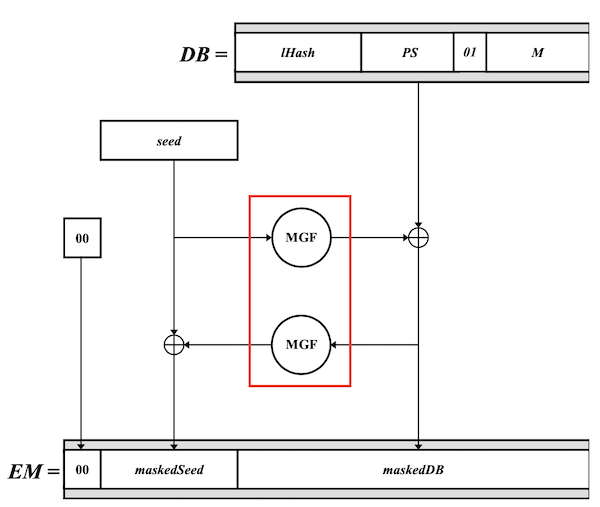
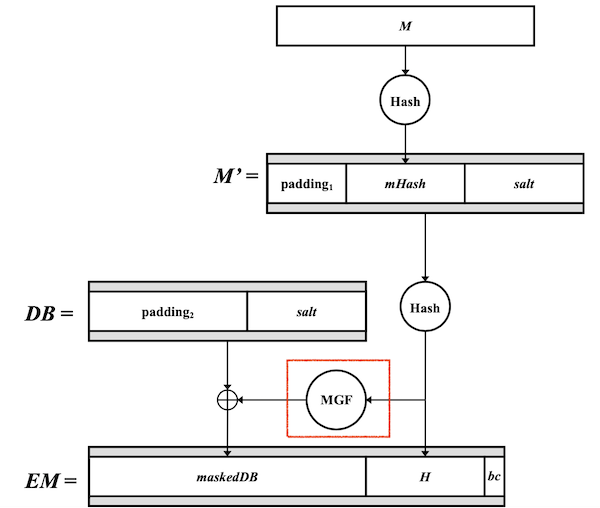

# RSA组件之MGF(Mask Generation Function)实现

### 1. RSA 算法中使用 MGF 函数
在非对称加密算法 RSA 中，如果加密模式为 RSA-OAEP 或签名方案为概率签名 RSA-PSS 时会用到一个 MGF 函数。

- OAEP: 最优非对称加密填充 Optimal Asymmetric Encryption Padding
- PSS: 概率签名方案, Probabilistic Signature Scheme
- MGF: 掩码生成函数, Mask Generation Function

RSA 最优非对称加密填充中两次调用 MGF 分别用于生成 maskedDB 和 maskedSeed 数据:



RSA 概率签名方案中调用 MGF 来生成 maskedDB 数据:



### 2. RFC 8017 中关于 MGF 函数的描述
MGF 函数基于哈希函数来构建，RSA 规范中使用的 MGF 函数是 MGF1，其在 [RFC 8017](https://www.rfc-editor.org/rfc/rfc8017.txt) 附录 B2 中的描述如下:

```
B.2.  Mask Generation Functions

   A mask generation function takes an octet string of variable length
   and a desired output length as input and outputs an octet string of
   the desired length.  There may be restrictions on the length of the
   input and output octet strings, but such bounds are generally very
   large.  Mask generation functions are deterministic; the octet string
   output is completely determined by the input octet string.  The
   output of a mask generation function should be pseudorandom: Given
   one part of the output but not the input, it should be infeasible to
   predict another part of the output.  The provable security of
   RSAES-OAEP and RSASSA-PSS relies on the random nature of the output
   of the mask generation function, which in turn relies on the random
   nature of the underlying hash.

   One mask generation function is given here: MGF1, which is based on a
   hash function.  MGF1 coincides with the mask generation functions
   defined in IEEE 1363 [IEEE1363] and ANSI X9.44 [ANSIX944].  Future
   versions of this document may define other mask generation functions.

B.2.1.  MGF1

   MGF1 is a mask generation function based on a hash function.

   MGF1 (mgfSeed, maskLen)

   Options:

      Hash     hash function (hLen denotes the length in octets of
               the hash function output)

   Input:

      mgfSeed  seed from which mask is generated, an octet string
      maskLen  intended length in octets of the mask, at most 2^32 hLen

   Output:

      mask     mask, an octet string of length maskLen

   Error: "mask too long"

   Steps:

   1.  If maskLen > 2^32 hLen, output "mask too long" and stop.

   2.  Let T be the empty octet string.

   3.  For counter from 0 to \ceil (maskLen / hLen) - 1, do the
       following:

       A.  Convert counter to an octet string C of length 4 octets (see
           Section 4.1):

              C = I2OSP (counter, 4) .

       B.  Concatenate the hash of the seed mgfSeed and C to the octet
           string T:

              T = T || Hash(mgfSeed || C) .

   4.  Output the leading maskLen octets of T as the octet string mask.
```

说重点, MGF1 是一个伪随机函数，其输入参数是一个任意长度的位串 mgfSeed 和需要输出的掩码位长 maskLen，基于哈希函数构造。

1. MGF1 有两个参数 mgfSeed 和 maskLen
   - mgfSeed 是输入的随机变量
   - maskLen 是输出的掩码长度

2. MGF1 内部根据需要调用一个哈希函数，默认为 SHA1，其输出哈希长度为 hLen
3. MGF1 函数内部有一个计数器 counter，其大小为 0 ~ maskLen / hLen
4. 将 counter 转换成 4 字节的字符串 C，附加到 mgfSeed 的末尾并计算哈希

```
Hash(mgfSeed || C)
```

5. 递增计数器，计算哈希输出，并链接前一个哈希输出的末尾，直到输出位长的长度达到要求(不少于 maskLen)，然后截取前面的 maskLen 字节并返回

所以整个格式类似:

```
Hash(mgfSeed||0x00000000) || Hash(mgfSeed||0x00000001) || Hash(mgfSeed||0x00000002)... Hash(mgfSeed||n)
```

### 3. MGF 函数代码

### 3.1 实现代码
整个过程的 C 语言代码如下:

- mgf.h
```c
#ifndef __ROCKY_MGF__H
#define __ROCKY_MGF__H

int MGF1(const char *mgfSeed, unsigned int mgfSeedLen, HASH_ALG alg, unsigned int maskLen, char *mask);

#endif
```

- mgf.c
```c
#include <stdio.h>
#include <string.h>

#include "hash.h"
#include "mgf.h"

#define MGF1_BUF_SIZE 256
int MGF1(const char *mgfSeed, unsigned int mgfSeedLen, HASH_ALG alg, unsigned int maskLen, char *mask)
{
    unsigned char buf[MGF1_BUF_SIZE], *p;
    unsigned long digestLen;
    unsigned long counter, length;

    if (mgfSeedLen > MGF1_BUF_SIZE - 4)
    {
        printf("MGF1 buffer is not long enough!\n");
        return -1;
    }

    // copy mgfSeed to buffer
    memcpy(buf, mgfSeed, mgfSeedLen);

    // clear rest buffer to 0
    p = buf + mgfSeedLen;
    memset(p, 0, MGF1_BUF_SIZE-mgfSeedLen);

    digestLen = HASH_GetDigestSize(alg, 0);

    counter = 0;
    length = 0;

    while (length < maskLen)
    {
        // 将计数器 counter 转换成 4 字节串
        p[0] = (counter >> 0x24) & 0xff;
        p[1] = (counter >> 0x16) & 0xff;
        p[2] = (counter >> 0x08) & 0xff;
        p[3] = counter & 0xff;

        // 计算 mgfSeed + counter 的哈希
        HASH(alg, buf, mgfSeedLen+4, (unsigned char *)mask);

        // 更新计数器和地址
        length += digestLen;
        mask += digestLen;

        counter ++;
    }

    return 0;
}
```

其中使用到一个计算哈希函数的库 libhash.a，其头文件如下:

- hash.h
```c
/*
 * @        file: hash.h
 * @ description: header file for hash.c
 * @      author: Gu Yongqiang
 * @        blog: https://blog.csdn.net/guyongqiangx
 */
#ifndef __ROCKY_HASH__H
#define __ROCKY_HASH__H
#include "type.h"

/* Hash Algorithm List */
typedef enum {
    HASH_ALG_MD2,
    HASH_ALG_MD4,
    HASH_ALG_MD5,
    HASH_ALG_SHA1,
    HASH_ALG_SHA224,
    HASH_ALG_SHA256,
    HASH_ALG_SHA384,
    HASH_ALG_SHA512,
    HASH_ALG_SHA512_224,
    HASH_ALG_SHA512_256,
    HASH_ALG_SHA512_T,
    HASH_ALG_SHA3_224,
    HASH_ALG_SHA3_256,
    HASH_ALG_SHA3_384,
    HASH_ALG_SHA3_512,
    HASH_ALG_SHAKE128,
    HASH_ALG_SHAKE256,
    HASH_ALG_SM3,
    HASH_ALG_MAX,
    HASH_ALG_INVALID
} HASH_ALG;

typedef struct hash_context {
    /*
     * currently we don't use below 3 stuffs,
     * just for future use, like hmac, hash_drbg, hmac_drbg and so on.
     */
    HASH_ALG alg;
    uint32_t block_size;
    uint32_t digest_size;

    void     *impl;
}HASH_CTX;

int HASH_Init(HASH_CTX *ctx, HASH_ALG alg);
int HASH_Update(HASH_CTX *ctx, const void *data, size_t len);
int HASH_Final(unsigned char *md, HASH_CTX *ctx);
unsigned char *HASH(HASH_ALG alg, const unsigned char *data, size_t n, unsigned char *md);

/*
 * For SHA-512t, SHAKE128, SHAKE256
 */
int HASH_Init_Ex(HASH_CTX *ctx, HASH_ALG alg, uint32_t ext);
unsigned char *HASH_Ex(HASH_ALG alg, const unsigned char *data, size_t n, unsigned char *md, uint32_t ext);

uint32_t HASH_GetBlockSize(HASH_ALG alg);
uint32_t HASH_GetDigestSize(HASH_ALG alg, uint32_t ext);

#endif
```

### 3.2 测试代码

- mgftest.c

这里的测试内容参考维基百科 MGF 词条中使用 python 测试的内容，具体参考代码中的注释段。

```c
#include <stdio.h>
#include "hash.h"
#include "mgf.h"

/*
 * From: https://en.wikipedia.org/wiki/Mask_generation_function
 *
 * Example outputs of MGF1:
 *
 * Python 2.7.6 (default, Sep  9 2014, 15:04:36) 
 * [GCC 4.2.1 Compatible Apple LLVM 6.0 (clang-600.0.39)] on darwin
 * Type "help", "copyright", "credits" or "license" for more information.
 * >>> from mgf1 import mgf1
 * >>> from binascii import hexlify
 * >>> from hashlib import sha256
 * >>> hexlify(mgf1('foo', 3))
 * '1ac907'
 * >>> hexlify(mgf1('foo', 5))
 * '1ac9075cd4'
 * >>> hexlify(mgf1('bar', 5))
 * 'bc0c655e01'
 * >>> hexlify(mgf1('bar', 50))
 * 'bc0c655e016bc2931d85a2e675181adcef7f581f76df2739da74faac41627be2f7f415c89e983fd0ce80ced9878641cb4876'
 * >>> hexlify(mgf1('bar', 50, sha256))
 * '382576a7841021cc28fc4c0948753fb8312090cea942ea4c4e735d10dc724b155f9f6069f289d61daca0cb814502ef04eae1'
 */
int main(int argc, char *argv)
{
    int i;
    char buf[1024];

    MGF1("foo", 3, HASH_ALG_SHA1, 3, buf);
    for (i=0; i<3; i++)
    {
        printf("%02x", ((unsigned char *)buf)[i]);
    }
    printf("\n");

    MGF1("foo", 3, HASH_ALG_SHA1, 5, buf);
    for (i=0; i<5; i++)
    {
        printf("%02x", ((unsigned char *)buf)[i]);
    }
    printf("\n");

    MGF1("bar", 3, HASH_ALG_SHA1, 5, buf);
    for (i=0; i<5; i++)
    {
        printf("%02x", ((unsigned char *)buf)[i]);
    }
    printf("\n");

    MGF1("bar", 3, HASH_ALG_SHA1, 50, buf);
    for (i=0; i<50; i++)
    {
        printf("%02x", ((unsigned char *)buf)[i]);
    }
    printf("\n");

    MGF1("bar", 3, HASH_ALG_SHA256, 50, buf);
    for (i=0; i<50; i++)
    {
        printf("%02x", ((unsigned char *)buf)[i]);
    }
    printf("\n");

    return 0;
}
```

### 3.3 编译代码和并测试

使用如下命令编译:
```shell
cc mgftest.c mgf.c -o mgftest -I/public/ygu/cryptography/crypto-work.git/out/include -L/public/ygu/cryptography/crypto-work.git/out/lib -lhash
```

这里使用了 `-I` 和 `-L` 选项来指定哈希函数库的头文件和库文件位置。

执行结果如下:
```shell
/public/ygu/cryptography/crypto-work.git/mgf$ ./mgftest 
1ac907
1ac9075cd4
bc0c655e01
bc0c655e016bc2931d85a2e675181adcef7f581f76df2739da74faac41627be2f7f415c89e983fd0ce80ced9878641cb4876
382576a7841021cc28fc4c0948753fb8312090cea942ea4c4e735d10dc724b155f9f6069f289d61daca0cb814502ef04eae1
```

## 4. 其它

洛奇工作中常常会遇到自己不熟悉的问题，这些问题可能并不难，但因为不了解，找不到人帮忙而瞎折腾，往往导致浪费几天甚至更久的时间。

所以我组建了几个微信讨论群(记得微信我说加哪个群，如何加微信见后面)，欢迎一起讨论:
- 一个密码编码学讨论组，主要讨论各种加解密，签名校验等算法，请说明加密码学讨论群。
- 一个Android OTA的讨论组，请说明加Android OTA群。
- 一个git和repo的讨论组，请说明加git和repo群。

在工作之余，洛奇尽量写一些对大家有用的东西，如果洛奇的这篇文章让您有所收获，解决了您一直以来未能解决的问题，不妨赞赏一下洛奇，这也是对洛奇付出的最大鼓励。扫下面的二维码赞赏洛奇，金额随意：


洛奇自己维护了一个公众号“洛奇看世界”，一个很佛系的公众号，不定期瞎逼逼。公号也提供个人联系方式，一些资源，说不定会有意外的收获，详细内容见公号提示。扫下方二维码关注公众号：


