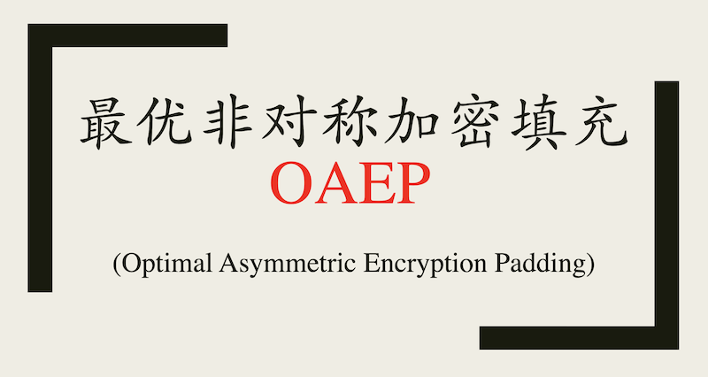
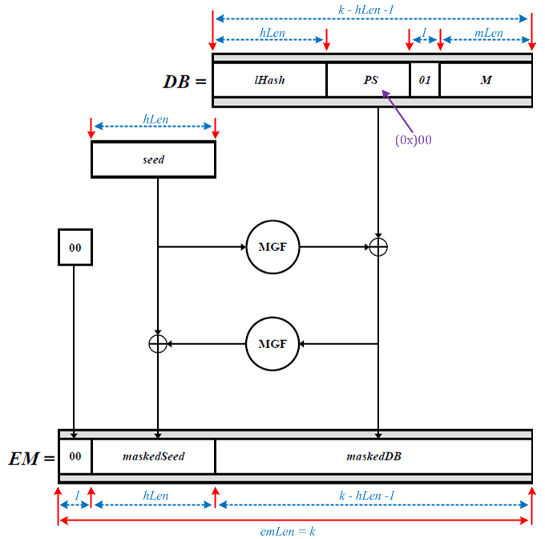

# RSA组件之最优非对称加密填充(OAEP)的实现(C源码)



## 1. RSA 算法中使用 OAEP 最优非对称加密填充函数

在非对称加密算法 RSA 中，算法本身非常简洁，公钥 $(e, n)$, 私钥$ (d, n)$。
- 加密: $C\ =\ M^e\ mod\ n$
- 解密: $M\ =\ C^d\ mod\ n$

上面描述 RSA 加解密时着重强调原理，所以是一种“教科书式的RSA”系统，存在一些缺陷，例如:
- RSA 的加密是确定的，秘钥确定后，特定的明文总是映射到特定的密文。因此攻击者可以从大量密文中获取明文的统计属性。
- 对于明文: M = 0, M = 1, M = -1的情况，其密文也分别是 C = 0, C = 1, C = -1
- 为了快速计算，这里的公钥 $(e, n)$ 中的 e 通常都选择一个小指数 3, 17 或 65537。如果明文 M 的值也较小的话，则容易受到攻击

因此实际中的 RSA 需要与填充方案(padding) 一起使用。在最新的 PKCS #1 v2.2 ([RFC 8017, PKCS #1: RSA Cryptography Specifications Version 2.2](https://www.rfc-editor.org/rfc/rfc8017.txt)) 中，针对 RSA 加解密，提供了两种填充方案:
- 一种是从 PKCS #1 v1.5 中提出的填充方案 PKCS-v1.5
- 一种是从 PKCS #1 v2.0 开始提出的填充方案 OAEP

PKCS-v1.5 填充比较简单，OAEP 填充比较复杂，本篇主要基于 OAEP 填充方案提供 C 语言的实现。

> RSA 中的一些缩略语:
> - OAEP: 最优非对称加密填充 Optimal Asymmetric Encryption Padding
> - PSS: 概率签名方案, Probabilistic Signature Scheme
> - MGF: 掩码生成函数, Mask Generation Function

## 2. OAEP 消息编码的格式

OAEP 消息格式如下:

```
EME-OAEP Encoding Operation
                               +----------+------+--+-------+
                          DB = |  lHash   |  PS  |01|   M   |
                               +----------+------+--+-------+
                                              |
                    +----------+              |
                    |   seed   |              |
                    +----------+              |
                          |                   |
                          |-------> MGF ---> xor
                          |                   |
                 +--+     V                   |
                 |00|    xor <----- MGF <-----|
                 +--+     |                   |
                   |      |                   |
                   V      V                   V
                 +--+----------+----------------------------+
           EM =  |00|maskedSeed|          maskedDB          |
                 +--+----------+----------------------------+
   DB: Data Block
lHash: Hash(L)
   PS: Padding String, k - mLen - 2hLen - 2 zero octets
   01: a single octet with hexadecimal value 0x01
    M: message to be encrypted
       DB = lHash || PS || 0x01 || M
   EM: Encoded Message
 */
```

或者如下图:




关于各种长度:

- EM 的长度。

    RSA 密钥中模数 n 的长度为 $len(n) = k$，因此编码消息 EM 的长度也为 $len(EM) = k$。

    EM 开头填充了一个字节的 0x00。

    EM 中 maskedSeed 的长度和 seed 的长度一样，都是 hLen，即 $len(maskedSeed) = len(seed) = hLen$。

    因此，EM 中 maskedDB 的长度就为 $len(maskedDB) = k - 1 - hLen$。

- seed 的长度

    文档规定 seed 的长度和所使用的哈希函数输出的长度一样，都是 hLen。

- DB 的长度

    初步填充后的数据 DB 的长度和 EM 中 maskedDB 的长度一样，为 $len(maskedDB) = len(DB) = k - 1 - hLen$

    DB 中 lHash 的长度为 hLen， M 的长度为 mLen，DB 中填充了一个字节 0x01。

    因此，DB 中填充字节串 PS 的长度为: $len(PS) = len(DB) - hLen - 1 - mLen = k - 2hLen - 2 - mLen$

根据文档的描述，填充字符串 PS 的最短长度为 0, 所以 $k - 2hLen - 2 - mLen \geq 0$，也就要求 $mLen \leq k - 2hLen - 2$

针对最优非对称加密填充方案(OAEP)，RFC 8017 的第 7.1.1 和第 7.1.2 节分别描述了填充中消息编码和解码的细节。

## 3. OAEP 编码

在 [RFC 8017](https://www.rfc-editor.org/rfc/rfc8017.txt) 的第 7.1.1 节对这个填充做了详细的描述，根据待编码的消息 M 和可选字节串 L 生成编码消息 EM。

这里将原文描述摘录如下:

```
7.1.1.  Encryption Operation
Steps:
  2.  EME-OAEP encoding (see Figure 1 below):

    a.  If the label L is not provided, let L be the empty string.
        Let lHash = Hash(L), an octet string of length hLen (see
        the note below).

    b.  Generate a padding string PS consisting of k - mLen -
        2hLen - 2 zero octets.  The length of PS may be zero.

    c.  Concatenate lHash, PS, a single octet with hexadecimal
        value 0x01, and the message M to form a data block DB of
        length k - hLen - 1 octets as

            DB = lHash || PS || 0x01 || M.

    d.  Generate a random octet string seed of length hLen.

    e.  Let dbMask = MGF(seed, k - hLen - 1).

    f.  Let maskedDB = DB \xor dbMask.

    g.  Let seedMask = MGF(maskedDB, hLen).

    h.  Let maskedSeed = seed \xor seedMask.

    i.  Concatenate a single octet with hexadecimal value 0x00,
        maskedSeed, and maskedDB to form an encoded message EM of
        length k octets as

            EM = 0x00 || maskedSeed || maskedDB.
```

OAEP 填充中，主要有三个步骤:

1. 构造数据块 DB;
2. 构造随机字节串 seed;
3. 基于 DB 和 seed 通过 MGF 函数分别生成 maskedDB 和 maskedSeed，用于构造 EM;


构造 DB，需要有两个输入: 1. 待填充的消息 M; 2. 可选字节串 L，其哈希值用于构造数据块 DB，如果没有提供 L，则使用空字符串

废话少说，上代码，OAEP Encoding 编码函数如下:

```c
/**
 * @description: 
 * @param {HASH_ALG} alg, OAEP 填充使用的哈希算法
 * @param {unsigned long} k, RSA 秘钥中模数 n 的长度
 * @param {char} *M, 待填充的消息 M
 * @param {unsigned long} mLen, 带填充消息 M 的长度
 * @param {char} *L, 可选字符串 L, 为空则计算空字符串 "" 的哈希
 * @param {unsigned long} lLen, 可选字符串 L 的长度
 * @param {char} *EM, OAEP 填充编码后输出的消息
 * @param {unsigned long} emLen, OAEP 填充编码生成消息的长度，和 k 值一样
 * @return {*}, 编码成功返回 0; 编码失败返回 -1;
 */
int OAEP_Encoding(HASH_ALG alg, unsigned long k, char *M, unsigned long mLen, const char *L, unsigned long lLen, char *EM, unsigned long emLen)
{
    unsigned long hLen, psLen;
    unsigned char buf[OAEP_BUF_SIZE];
    unsigned char *p, *pSeed, *pDB;
    unsigned char *maskedSeed, *maskedDB;

    //       +-- hLen --+-------  k - hLen - 1  -----+ 1+
    //       |          |                            |  |
    //       +----------+----------------------------+--+
    // buf = |   seed   |             DB             |00|
    //       +----------+----------------------------+--+

    // 检查参数
    if ((NULL == M) || (0 == mLen) ||
        (NULL == EM) || (0 == emLen) ||
        (0 == k) || (k != emLen))
    {
        return -1;
    }

    // 检查 L 长度, 假定 lLen <= 1024 字符, 文档要求 lLen < 2^61 - 1
    if ((NULL != L) && (lLen > 1024))
    {
        printf("label too long\n");
        return -1;
    }

    hLen = HASH_GetDigestSize(alg, 0);

    // 检查 mLen
    if (mLen > k - 2 * hLen - 2)
    {
        printf("message too long\n");
        return -1;
    }

    pSeed = buf;
    pDB   = buf + hLen;

    maskedSeed = EM + 1;
    maskedDB   = EM + 1 + hLen;

    p     = pDB; // p 指向 db

    /*
     * 1. 构造 DB 数据块: DB = lHash || PS || 0x01 || M
     */
    // 取 label L 的哈希值
    if (NULL == L)
    {
        HASH(alg, "", 0, p);
    }
    else
    {
        HASH(alg, L, lLen, p);
    }
    p += hLen;

    // 填充 PS
    psLen = k - mLen - 2 * hLen - 2;
    if (0 != psLen)
    {
        memset(p, 0, psLen);
    }
    p += psLen;

    // 填充常量 0x01
    *p = 0x01;
    p ++;

    // 复制消息 M
    memcpy(p, M, mLen);

    /*
     * 2. 构造长度为 hLen 的随机字节串 seed
     */
    Get_Random_Bytes(pSeed, hLen);

    /*
     * 3. 生成 maskedDB
     */
    // dbMask = MGF(seed, k - hLen - 1)
    MGF1(pSeed, hLen, alg, k-hLen-1, maskedDB);

    // maskedDB = DB \xor dbMask
    xor(maskedDB, pDB, k-hLen-1);

    /*
     * 4. 生成 maskedSeed
     */
    // seedMask = MGF(maskedDB, hLen)
    MGF1(maskedDB, k-hLen-1, alg, hLen, maskedSeed);

    // maskedSeed = seed \xor seedMask
    xor(maskedSeed, pSeed, hLen);

    /*
     * 5. 填充 EM[0] = 0
     */
    EM[0] = 0;

    return 0;
}
```

## 4. OAEP 解码

OAEP 解码是 OAEP 编码的逆向操作。

在 [RFC 8017](https://www.rfc-editor.org/rfc/rfc8017.txt) 的第 7.1.2 节对解码操作做了详细的描述，根据已经编码的消息 EM 和可选字节串 L，使用编码的反向操作解码得到原始的消息 M。

这里将原文描述摘录如下:

```
7.1.2.  Decryption Operation
Steps:
  3.  EME-OAEP decoding:

    a.  If the label L is not provided, let L be the empty string.
        Let lHash = Hash(L), an octet string of length hLen (see
        the note in Section 7.1.1).

    b.  Separate the encoded message EM into a single octet Y, an
        octet string maskedSeed of length hLen, and an octet
        string maskedDB of length k - hLen - 1 as

            EM = Y || maskedSeed || maskedDB.

    c.  Let seedMask = MGF(maskedDB, hLen).

    d.  Let seed = maskedSeed \xor seedMask.

    e.  Let dbMask = MGF(seed, k - hLen - 1).

    f.  Let DB = maskedDB \xor dbMask.

    g.  Separate DB into an octet string lHash' of length hLen, a
        (possibly empty) padding string PS consisting of octets
        with hexadecimal value 0x00, and a message M as

            DB = lHash' || PS || 0x01 || M.

        If there is no octet with hexadecimal value 0x01 to
        separate PS from M, if lHash does not equal lHash', or if
        Y is nonzero, output "decryption error" and stop.  (See
        the note below.)
```

我们也可以根据第 2 节中编码的格式，从 EM 中一步一步提取原始消息 M:
1. 分割 EM 消息

    去除 EM 头部的填充字节 0x00, 使用哈希函数输出的长度 hLen 进行分割, 得到 maskedSeed 和 maskedDB

2. 使用 maskedDB 和 maskedSeed 反推得到 seed;
3. 使用 seed 和 maskedDB 反推得到填充数据块 DB;
4. 剥离 DB 头部的 lHash，然后根据填充的全 0x00 字节串以及填充结束的标记 0x01 找到消息 M 的起始位置进而解码出原始消息。

代码如下:

```c
/**
 * @description: 
 * @param {HASH_ALG} alg, OAEP 填充使用的哈希算法
 * @param {unsigned long} k, RSA 秘钥中模数 n 的长度
 * @param {char} *L, 可选字符串 L, 为空则计算空字符串 "" 的哈希
 * @param {unsigned long} lLen, 可选字符串 L 的长度
 * @param {char} *EM, OAEP 中待解码的消息
 * @param {unsigned long} emLen, OAEP 中待解码消息的长度
 * @param {char} *M, OAEP 解码还原得到的消息
 * @param {unsigned long} *mLen, OAEP 解码还原得到的消息的长度
 * @return {*}, 解码成功返回 0, 解码失败返回 -1
 */ 
int OAEP_Decoding(HASH_ALG alg, unsigned long k, const char *L, unsigned long lLen, char *EM, unsigned long emLen, char *M, unsigned long *mLen)
{
    unsigned long hLen, psLen, mSize;
    unsigned char buf[OAEP_BUF_SIZE];
    unsigned char *p, *pSeed, *pDB;
    unsigned char *maskedSeed, *maskedDB;

    //       +-- hLen --+-------  k - hLen - 1  -----+ 1+
    //       |          |                            |  |
    //       +----------+----------------------------+--+
    // buf = |   seed   |             DB             |00|
    //       +----------+----------------------------+--+

    // 检查参数
    if ((NULL == M) || (NULL == EM) || (0 == k))
    {
        return -1;
    }

    // 检查 L 长度, 假定 lLen <= 1024 字符, 文档要求 lLen < 2^61 - 1
    if ((NULL != L) && (lLen > 1024))
    {
        printf("decryption error\n");
        return -1;
    }

    // 检查密文长度 emLen == k
    if (k != emLen)
    {
        printf("decryption error\n");
        return -1;
    }

    hLen = HASH_GetDigestSize(alg, 0);

    // 检查 k
    if (k < 2 * hLen + 2)
    {
        printf("decryption error\n");
        return -1;
    }

    pSeed = buf;
    pDB   = buf + hLen;

    maskedSeed = EM + 1;
    maskedDB   = EM + 1 + hLen;

    /*
     * 1. 检查 EM 数据格式 (是否以 0x00 开头)
     */

    // 检查 Y = EM[0] == 0x00
    if (EM[0] != 0x00)
    {
        printf("decryption error");
        return -1;
    }

    /*
     * 2. 解析 EM 数据得到 DB 数据
     */

    // seedMask = MGF(maskedDB, hLen)
    MGF1(maskedDB, k - hLen - 1, alg, hLen, pSeed);

    // seed = maskedSeed \xor seedMask
    xor(pSeed, maskedSeed, hLen);

    // dbMask = MGF(seed, k-hLen-1)
    MGF1(pSeed, hLen, alg, k-hLen-1, pDB);

    // DB = maskedDB \xor dbMask
    xor(pDB, maskedDB, k-hLen-1);

    /*
     * 3. 检查 DB 数据格式
     */

    // 取 label L 的哈希值
    if (NULL == L)
    {
        HASH(alg, "", 0, pSeed);
    }
    else
    {
        HASH(alg, L, lLen, pSeed);
    }

    // 检查 DB 开头的 label L 的哈希值
    if (0 != memcmp(pSeed, pDB, hLen))
    {
        printf("decryption error");
        return -1;
    }

    // 跳过填充数据 PS 直到非 0x00 数据
    p     = pDB + hLen; // p 指向 PS
    mSize = k - 1 - hLen - hLen;
    while (*p == 0x00)
    {
        p ++;
        mSize --;
    }

    // 检查 PS 结束的位置是否为 0x01
    if (*p != 0x01)
    {
        printf("decryption error");
        return -1;
    }

    // 跳过 0x01;
    p ++;
    mSize --;

    // 提取最后的数据到 M 中，长度为 mLen
    memcpy(M, p, mSize);
    *mLen = mSize;

    return 0;
}
```

## 5. OAEP 验证的测试向量

有了编码和解码函数，那要如何验证呢？

碰巧在 OAEP 早期的设计文档中，找到了一组测试数据。

原始文档名称为 [RSAES-OAEP Encryption Scheme](https://www.inf.pucrs.br/~calazans/graduate/TPVLSI_I/RSA-oaep_spec.pdf)
- https://www.inf.pucrs.br/~calazans/graduate/TPVLSI_I/RSA-oaep_spec.pdf

需要特别说明的是，文档是 OAEP 的早期设计文档，其填充的编码消息的长度为 k - 1，在当前 PKCS #1 v2.2 中，需要对 EM 头部再填充一个 0x00 的字节，这样 EM 的长度和 RSA 密钥中模数 n 的长度一致，都为 n。在我的测试代码中，已经在 EM 的开头加入了这一填充的字节 0x00。

### 5.1 测试代码

oaeptest.c
```c
#include <stdio.h>
#include <string.h>
#include "hash.h"
#include "mgf.h"
#include "rand.h"
#include "oaep.h"

// 测试数据来自文档: 《RSAES-OAEP Encryption Scheme》, 附录 C. Test Vectors
// https://www.inf.pucrs.br/~calazans/graduate/TPVLSI_I/RSA-oaep_spec.pdf

/*
 * RSA Key Information
 */
// n, the modulus
static char n[] = {
    0xbb, 0xf8, 0x2f, 0x09, 0x06, 0x82, 0xce, 0x9c, 0x23, 0x38, 0xac, 0x2b, 0x9d, 0xa8, 0x71, 0xf7,
    0x36, 0x8d, 0x07, 0xee, 0xd4, 0x10, 0x43, 0xa4, 0x40, 0xd6, 0xb6, 0xf0, 0x74, 0x54, 0xf5, 0x1f,
    0xb8, 0xdf, 0xba, 0xaf, 0x03, 0x5c, 0x02, 0xab, 0x61, 0xea, 0x48, 0xce, 0xeb, 0x6f, 0xcd, 0x48,
    0x76, 0xed, 0x52, 0x0d, 0x60, 0xe1, 0xec, 0x46, 0x19, 0x71, 0x9d, 0x8a, 0x5b, 0x8b, 0x80, 0x7f,
    0xaf, 0xb8, 0xe0, 0xa3, 0xdf, 0xc7, 0x37, 0x72, 0x3e, 0xe6, 0xb4, 0xb7, 0xd9, 0x3a, 0x25, 0x84,
    0xee, 0x6a, 0x64, 0x9d, 0x06, 0x09, 0x53, 0x74, 0x88, 0x34, 0xb2, 0x45, 0x45, 0x98, 0x39, 0x4e,
    0xe0, 0xaa, 0xb1, 0x2d, 0x7b, 0x61, 0xa5, 0x1f, 0x52, 0x7a, 0x9a, 0x41, 0xf6, 0xc1, 0x68, 0x7f,
    0xe2, 0x53, 0x72, 0x98, 0xca, 0x2a, 0x8f, 0x59, 0x46, 0xf8, 0xe5, 0xfd, 0x09, 0x1d, 0xbd, 0xcb
};

// e, the public exponent
static unsigned long e = 0x11; /* 17 */

// p, the first prime factor of n
static char p[] =
{
    0xee, 0xcf, 0xae, 0x81, 0xb1, 0xb9, 0xb3, 0xc9, 0x08, 0x81, 0x0b, 0x10, 0xa1, 0xb5, 0x60, 0x01,
    0x99, 0xeb, 0x9f, 0x44, 0xae, 0xf4, 0xfd, 0xa4, 0x93, 0xb8, 0x1a, 0x9e, 0x3d, 0x84, 0xf6, 0x32,
    0x12, 0x4e, 0xf0, 0x23, 0x6e, 0x5d, 0x1e, 0x3b, 0x7e, 0x28, 0xfa, 0xe7, 0xaa, 0x04, 0x0a, 0x2d,
    0x5b, 0x25, 0x21, 0x76, 0x45, 0x9d, 0x1f, 0x39, 0x75, 0x41, 0xba, 0x2a, 0x58, 0xfb, 0x65, 0x99
};

// q, the second prime factor of n
static char q[] =
{
    0xc9, 0x7f, 0xb1, 0xf0, 0x27, 0xf4, 0x53, 0xf6, 0x34, 0x12, 0x33, 0xea, 0xaa, 0xd1, 0xd9, 0x35,
    0x3f, 0x6c, 0x42, 0xd0, 0x88, 0x66, 0xb1, 0xd0, 0x5a, 0x0f, 0x20, 0x35, 0x02, 0x8b, 0x9d, 0x86,
    0x98, 0x40, 0xb4, 0x16, 0x66, 0xb4, 0x2e, 0x92, 0xea, 0x0d, 0xa3, 0xb4, 0x32, 0x04, 0xb5, 0xcf,
    0xce, 0x33, 0x52, 0x52, 0x4d, 0x04, 0x16, 0xa5, 0xa4, 0x41, 0xe7, 0x00, 0xaf, 0x46, 0x15, 0x03
};

// dP, p’s exponent:
static char dP[] =
{
    0x54, 0x49, 0x4c, 0xa6, 0x3e, 0xba, 0x03, 0x37, 0xe4, 0xe2, 0x40, 0x23, 0xfc, 0xd6, 0x9a, 0x5a,
    0xeb, 0x07, 0xdd, 0xdc, 0x01, 0x83, 0xa4, 0xd0, 0xac, 0x9b, 0x54, 0xb0, 0x51, 0xf2, 0xb1, 0x3e,
    0xd9, 0x49, 0x09, 0x75, 0xea, 0xb7, 0x74, 0x14, 0xff, 0x59, 0xc1, 0xf7, 0x69, 0x2e, 0x9a, 0x2e,
    0x20, 0x2b, 0x38, 0xfc, 0x91, 0x0a, 0x47, 0x41, 0x74, 0xad, 0xc9, 0x3c, 0x1f, 0x67, 0xc9, 0x81
};

// dQ, q’s exponent:
static char dQ[] =
{
    0x47, 0x1e, 0x02, 0x90, 0xff, 0x0a, 0xf0, 0x75, 0x03, 0x51, 0xb7, 0xf8, 0x78, 0x86, 0x4c, 0xa9,
    0x61, 0xad, 0xbd, 0x3a, 0x8a, 0x7e, 0x99, 0x1c, 0x5c, 0x05, 0x56, 0xa9, 0x4c, 0x31, 0x46, 0xa7,
    0xf9, 0x80, 0x3f, 0x8f, 0x6f, 0x8a, 0xe3, 0x42, 0xe9, 0x31, 0xfd, 0x8a, 0xe4, 0x7a, 0x22, 0x0d,
    0x1b, 0x99, 0xa4, 0x95, 0x84, 0x98, 0x07, 0xfe, 0x39, 0xf9, 0x24, 0x5a, 0x98, 0x36, 0xda, 0x3d
};

// qInv, the CRT coefficient
static char qInv[] =
{
    0xb0, 0x6c, 0x4f, 0xda, 0xbb, 0x63, 0x01, 0x19, 0x8d, 0x26, 0x5b, 0xdb, 0xae, 0x94, 0x23, 0xb3,
    0x80, 0xf2, 0x71, 0xf7, 0x34, 0x53, 0x88, 0x50, 0x93, 0x07, 0x7f, 0xcd, 0x39, 0xe2, 0x11, 0x9f,
    0xc9, 0x86, 0x32, 0x15, 0x4f, 0x58, 0x83, 0xb1, 0x67, 0xa9, 0x67, 0xbf, 0x40, 0x2b, 0x4e, 0x9e,
    0x2e, 0x0f, 0x96, 0x56, 0xe6, 0x98, 0xea, 0x36, 0x66, 0xed, 0xfb, 0x25, 0x79, 0x80, 0x39, 0xf7
};

/*
 * Intermedia Values for RSA Encryption
 */
// M, the message to be encrypted
static char M[] =
{
    0xd4, 0x36, 0xe9, 0x95, 0x69, 0xfd, 0x32, 0xa7, 0xc8, 0xa0, 0x5b, 0xbc, 0x90, 0xd3, 0x2c, 0x49
};

// P, encoding parameters
static char *P = ""; // P = NULL;

// pHash = Hash(P) = SHA1(P)
// $ echo -n "" | sha1sum | awk '{print $1}' | xxd -r -ps | xxd -i -c 16
//   0xda, 0x39, 0xa3, 0xee, 0x5e, 0x6b, 0x4b, 0x0d, 0x32, 0x55, 0xbf, 0xef, 0x95, 0x60, 0x18, 0x90,
//   0xaf, 0xd8, 0x07, 0x09
static char pHash[] =
{
    0xda, 0x39, 0xa3, 0xee, 0x5e, 0x6b, 0x4b, 0x0d, 0x32, 0x55, 0xbf, 0xef, 0x95, 0x60, 0x18, 0x90,
    0xaf, 0xd8, 0x07, 0x09
};

// DB = pHash || PS || 01 || M
static char DB[] =
{
    0xda, 0x39, 0xa3, 0xee, 0x5e, 0x6b, 0x4b, 0x0d, 0x32, 0x55, 0xbf, 0xef, 0x95, 0x60, 0x18, 0x90,
    0xaf, 0xd8, 0x07, 0x09, 0x00, 0x00, 0x00, 0x00, 0x00, 0x00, 0x00, 0x00, 0x00, 0x00, 0x00, 0x00,
    0x00, 0x00, 0x00, 0x00, 0x00, 0x00, 0x00, 0x00, 0x00, 0x00, 0x00, 0x00, 0x00, 0x00, 0x00, 0x00,
    0x00, 0x00, 0x00, 0x00, 0x00, 0x00, 0x00, 0x00, 0x00, 0x00, 0x00, 0x00, 0x00, 0x00, 0x00, 0x00,
    0x00, 0x00, 0x00, 0x00, 0x00, 0x00, 0x00, 0x00, 0x00, 0x00, 0x00, 0x00, 0x00, 0x00, 0x00, 0x00,
    0x00, 0x00, 0x00, 0x00, 0x00, 0x00, 0x00, 0x00, 0x00, 0x00, 0x01, 0xd4, 0x36, 0xe9, 0x95, 0x69,
    0xfd, 0x32, 0xa7, 0xc8, 0xa0, 0x5b, 0xbc, 0x90, 0xd3, 0x2c, 0x49
};

// seed, a random octet string
static char seed[] =
{
    0xaa, 0xfd, 0x12, 0xf6, 0x59, 0xca, 0xe6, 0x34, 0x89, 0xb4, 0x79, 0xe5, 0x07, 0x6d, 0xde, 0xc2,
    0xf0, 0x6c, 0xb5, 0x8f
};

// dbMask = MGF1(seed, 107)
static char dbMask[] =
{
    0x06, 0xe1, 0xde, 0xb2, 0x36, 0x9a, 0xa5, 0xa5, 0xc7, 0x07, 0xd8, 0x2c, 0x8e, 0x4e, 0x93, 0x24,
    0x8a, 0xc7, 0x83, 0xde, 0xe0, 0xb2, 0xc0, 0x46, 0x26, 0xf5, 0xaf, 0xf9, 0x3e, 0xdc, 0xfb, 0x25,
    0xc9, 0xc2, 0xb3, 0xff, 0x8a, 0xe1, 0x0e, 0x83, 0x9a, 0x2d, 0xdb, 0x4c, 0xdc, 0xfe, 0x4f, 0xf4,
    0x77, 0x28, 0xb4, 0xa1, 0xb7, 0xc1, 0x36, 0x2b, 0xaa, 0xd2, 0x9a, 0xb4, 0x8d, 0x28, 0x69, 0xd5,
    0x02, 0x41, 0x21, 0x43, 0x58, 0x11, 0x59, 0x1b, 0xe3, 0x92, 0xf9, 0x82, 0xfb, 0x3e, 0x87, 0xd0,
    0x95, 0xae, 0xb4, 0x04, 0x48, 0xdb, 0x97, 0x2f, 0x3a, 0xc1, 0x4e, 0xaf, 0xf4, 0x9c, 0x8c, 0x3b,
    0x7c, 0xfc, 0x95, 0x1a, 0x51, 0xec, 0xd1, 0xdd, 0xe6, 0x12, 0x64
};

// maskedDB = DB ^ dbMask
static char maskedDB[] =
{
    0xdc, 0xd8, 0x7d, 0x5c, 0x68, 0xf1, 0xee, 0xa8, 0xf5, 0x52, 0x67, 0xc3, 0x1b, 0x2e, 0x8b, 0xb4,
    0x25, 0x1f, 0x84, 0xd7, 0xe0, 0xb2, 0xc0, 0x46, 0x26, 0xf5, 0xaf, 0xf9, 0x3e, 0xdc, 0xfb, 0x25,
    0xc9, 0xc2, 0xb3, 0xff, 0x8a, 0xe1, 0x0e, 0x83, 0x9a, 0x2d, 0xdb, 0x4c, 0xdc, 0xfe, 0x4f, 0xf4,
    0x77, 0x28, 0xb4, 0xa1, 0xb7, 0xc1, 0x36, 0x2b, 0xaa, 0xd2, 0x9a, 0xb4, 0x8d, 0x28, 0x69, 0xd5,
    0x02, 0x41, 0x21, 0x43, 0x58, 0x11, 0x59, 0x1b, 0xe3, 0x92, 0xf9, 0x82, 0xfb, 0x3e, 0x87, 0xd0,
    0x95, 0xae, 0xb4, 0x04, 0x48, 0xdb, 0x97, 0x2f, 0x3a, 0xc1, 0x4f, 0x7b, 0xc2, 0x75, 0x19, 0x52,
    0x81, 0xce, 0x32, 0xd2, 0xf1, 0xb7, 0x6d, 0x4d, 0x35, 0x3e, 0x2d
};

// seedMask = MGF(maskedDB, 20)
static char seedMask[] =
{
    0x41, 0x87, 0x0b, 0x5a, 0xb0, 0x29, 0xe6, 0x57, 0xd9, 0x57, 0x50, 0xb5, 0x4c, 0x28, 0x3c, 0x08,
    0x72, 0x5d, 0xbe, 0xa9
};

// maskedSeed = seed ^ seedMask
static char maskedSeed[] =
{
    0xeb, 0x7a, 0x19, 0xac, 0xe9, 0xe3, 0x00, 0x63, 0x50, 0xe3, 0x29, 0x50, 0x4b, 0x45, 0xe2, 0xca,
    0x82, 0x31, 0x0b, 0x26
};

// EM = maskedSeed || maskedDB
//      eb 7a 19 ac e9 e3 00 63 50 e3 29 50 4b 45 e2 ca 82 31 0b 26 dc d8 7d 5c
//      68 f1 ee a8 f5 52 67 c3 1b 2e 8b b4 25 1f 84 d7 e0 b2 c0 46 26 f5 af f9
//      3e dc fb 25 c9 c2 b3 ff 8a e1 0e 83 9a 2d db 4c dc fe 4f f4 77 28 b4 a1
//      b7 c1 36 2b aa d2 9a b4 8d 28 69 d5 02 41 21 43 58 11 59 1b e3 92 f9 82
//      fb 3e 87 d0 95 ae b4 04 48 db 97 2f 3a c1 4f 7b c2 75 19 52 81 ce 32 d2
//      f1 b7 6d 4d 35 3e 2d
// /*
//  * No pre 0x00 in EM in the document, for PKCS #1 v2.2, a 0x00 should be added
//  */

static char EM[] =
{
    0x00, 0xeb, 0x7a, 0x19, 0xac, 0xe9, 0xe3, 0x00, 0x63, 0x50, 0xe3, 0x29, 0x50, 0x4b, 0x45, 0xe2,
    0xca, 0x82, 0x31, 0x0b, 0x26, 0xdc, 0xd8, 0x7d, 0x5c, 0x68, 0xf1, 0xee, 0xa8, 0xf5, 0x52, 0x67,
    0xc3, 0x1b, 0x2e, 0x8b, 0xb4, 0x25, 0x1f, 0x84, 0xd7, 0xe0, 0xb2, 0xc0, 0x46, 0x26, 0xf5, 0xaf,
    0xf9, 0x3e, 0xdc, 0xfb, 0x25, 0xc9, 0xc2, 0xb3, 0xff, 0x8a, 0xe1, 0x0e, 0x83, 0x9a, 0x2d, 0xdb,
    0x4c, 0xdc, 0xfe, 0x4f, 0xf4, 0x77, 0x28, 0xb4, 0xa1, 0xb7, 0xc1, 0x36, 0x2b, 0xaa, 0xd2, 0x9a,
    0xb4, 0x8d, 0x28, 0x69, 0xd5, 0x02, 0x41, 0x21, 0x43, 0x58, 0x11, 0x59, 0x1b, 0xe3, 0x92, 0xf9,
    0x82, 0xfb, 0x3e, 0x87, 0xd0, 0x95, 0xae, 0xb4, 0x04, 0x48, 0xdb, 0x97, 0x2f, 0x3a, 0xc1, 0x4f,
    0x7b, 0xc2, 0x75, 0x19, 0x52, 0x81, 0xce, 0x32, 0xd2, 0xf1, 0xb7, 0x6d, 0x4d, 0x35, 0x3e, 0x2d
};

// C, the RSA encryption of EM
static char C[] =
{
    0x12, 0x53, 0xe0, 0x4d, 0xc0, 0xa5, 0x39, 0x7b, 0xb4, 0x4a, 0x7a, 0xb8, 0x7e, 0x9b, 0xf2, 0xa0,
    0x39, 0xa3, 0x3d, 0x1e, 0x99, 0x6f, 0xc8, 0x2a, 0x94, 0xcc, 0xd3, 0x00, 0x74, 0xc9, 0x5d, 0xf7,
    0x63, 0x72, 0x20, 0x17, 0x06, 0x9e, 0x52, 0x68, 0xda, 0x5d, 0x1c, 0x0b, 0x4f, 0x87, 0x2c, 0xf6,
    0x53, 0xc1, 0x1d, 0xf8, 0x23, 0x14, 0xa6, 0x79, 0x68, 0xdf, 0xea, 0xe2, 0x8d, 0xef, 0x04, 0xbb,
    0x6d, 0x84, 0xb1, 0xc3, 0x1d, 0x65, 0x4a, 0x19, 0x70, 0xe5, 0x78, 0x3b, 0xd6, 0xeb, 0x96, 0xa0,
    0x24, 0xc2, 0xca, 0x2f, 0x4a, 0x90, 0xfe, 0x9f, 0x2e, 0xf5, 0xc9, 0xc1, 0x40, 0xe5, 0xbb, 0x48,
    0xda, 0x95, 0x36, 0xad, 0x87, 0x00, 0xc8, 0x4f, 0xc9, 0x13, 0x0a, 0xde, 0xa7, 0x4e, 0x55, 0x8d,
    0x51, 0xa7, 0x4d, 0xdf, 0x85, 0xd8, 0xb5, 0x0d, 0xe9, 0x68, 0x38, 0xd6, 0x06, 0x3e, 0x09, 0x55
};

/*
 * Intermedia Values for RSA Decryption
 */
// c mod p (c is the integer value of C)
static char cmp[] =
{
    0xde, 0x63, 0xd4, 0x72, 0x35, 0x66, 0xfa, 0xa7, 0x59, 0xbf, 0xe4, 0x08, 0x82, 0x1d, 0xd5, 0x25,
    0x72, 0xec, 0x92, 0x85, 0x4d, 0xdf, 0x87, 0xa2, 0xb6, 0x64, 0xd4, 0x4d, 0xaa, 0x37, 0xca, 0x34,
    0x6a, 0x05, 0x20, 0x3d, 0x82, 0xff, 0x2d, 0xe8, 0xe3, 0x6c, 0xec, 0x1d, 0x34, 0xf9, 0x8e, 0xb6,
    0x05, 0xe2, 0xa7, 0xd2, 0x6d, 0xe7, 0xaf, 0x36, 0x9c, 0xe4, 0xec, 0xae, 0x14, 0xe3, 0x56, 0x33
};

// c mod q
static char cmq[] =
{
    0xa2, 0xd9, 0x24, 0xde, 0xd9, 0xc3, 0x6d, 0x62, 0x3e, 0xd9, 0xa6, 0x5b, 0x5d, 0x86, 0x2c, 0xfb,
    0xec, 0x8b, 0x19, 0x9c, 0x64, 0x27, 0x9c, 0x54, 0x14, 0xe6, 0x41, 0x19, 0x6e, 0xf1, 0xc9, 0x3c,
    0x50, 0x7a, 0x9b, 0x52, 0x13, 0x88, 0x1a, 0xad, 0x05, 0xb4, 0xcc, 0xfa, 0x02, 0x8a, 0xc1, 0xec,
    0x61, 0x42, 0x09, 0x74, 0xbf, 0x16, 0x25, 0x83, 0x6b, 0x0b, 0x7d, 0x05, 0xfb, 0xb7, 0x53, 0x36
};

// m1 = c^(dP) mod p = (c mod p)^(dP) mod p
static char m1[] =
{
    0x89, 0x6c, 0xa2, 0x6c, 0xd7, 0xe4, 0x87, 0x1c, 0x7f, 0xc9, 0x68, 0xa8, 0xed, 0xea, 0x11, 0xe2,
    0x71, 0x82, 0x4f, 0x0e, 0x03, 0x65, 0x52, 0x17, 0x94, 0xf1, 0xe9, 0xe9, 0x43, 0xb4, 0xa4, 0x4b,
    0x57, 0xc9, 0xe3, 0x95, 0xa1, 0x46, 0x74, 0x78, 0xf5, 0x26, 0x49, 0x6b, 0x4b, 0xb9, 0x1f, 0x1c,
    0xba, 0xea, 0x90, 0x0f, 0xfc, 0x60, 0x2c, 0xf0, 0xc6, 0x63, 0x6e, 0xba, 0x84, 0xfc, 0x9f, 0xf7
};

// m2 = c^(dQ) mod q = (c mod q)^(dQ) mod q
static char m2[] =
{
    0x4e, 0xbb, 0x22, 0x75, 0x85, 0xf0, 0xc1, 0x31, 0x2d, 0xca, 0x19, 0xe0, 0xb5, 0x41, 0xdb, 0x14,
    0x99, 0xfb, 0xf1, 0x4e, 0x27, 0x0e, 0x69, 0x8e, 0x23, 0x9a, 0x8c, 0x27, 0xa9, 0x6c, 0xda, 0x9a,
    0x74, 0x09, 0x74, 0xde, 0x93, 0x7b, 0x5c, 0x9c, 0x93, 0xea, 0xd9, 0x46, 0x2c, 0x65, 0x75, 0x02,
    0x1a, 0x23, 0xd4, 0x64, 0x99, 0xdc, 0x9f, 0x6b, 0x35, 0x89, 0x75, 0x59, 0x60, 0x8f, 0x19, 0xbe
};

// h = (m1 − m2)^(qInv) mod p
static char h[] =
{
    0x01, 0x2b, 0x2b, 0x24, 0x15, 0x0e, 0x76, 0xe1, 0x59, 0xbd, 0x8d, 0xdb, 0x42, 0x76, 0xe0, 0x7b,
    0xfa, 0xc1, 0x88, 0xe0, 0x8d, 0x60, 0x47, 0xcf, 0x0e, 0xfb, 0x8a, 0xe2, 0xae, 0xbd, 0xf2, 0x51,
    0xc4, 0x0e, 0xbc, 0x23, 0xdc, 0xfd, 0x4a, 0x34, 0x42, 0x43, 0x94, 0xad, 0xa9, 0x2c, 0xfc, 0xbe,
    0x1b, 0x2e, 0xff, 0xbb, 0x60, 0xfd, 0xfb, 0x03, 0x35, 0x9a, 0x95, 0x36, 0x8d, 0x98, 0x09, 0x25
};

// m = m2 + qh is equal to the integer value of the encoded message EM above.
// The intermediate values of the decoding operation are similar to those of the encoding operation.

int Get_Random_Bytes(char *buf, unsigned long len)
{
    memcpy(buf, seed, 20);

    return 0;
}

/*
 * cc oaeptest.c oaep.c -o oaeptest -I/public/ygu/cryptography/crypto-work.git/out/include -L/public/ygu/cryptography/crypto-work.git/out/lib -lhash -lmgf
 */
int main(int argc, char *argv[])
{
    unsigned long k, mLen;
    char buf_em[1024], buf_msg[1024];
    int i, res;

    k = sizeof(n)/sizeof(n[0]);
    mLen = sizeof(M)/sizeof(M[0]);

    // 生成 label L 的哈希
    printf("M= ");
    for (i=0; i<20; i++)
    {
        printf("%02x", ((unsigned char *)M)[i]);
    }
    printf("\n");

    // 生成 label L 的哈希
    HASH(HASH_ALG_SHA1, "", 0, buf_em);
    printf("Hash(\"\")= ");
    for (i=0; i<20; i++)
    {
        printf("%02x", ((unsigned char *)buf_em)[i]);
    }
    printf("\n\n");

    /*
     * OAEP Encoding Test
     */
    printf("Encoding Test: \n");
    OAEP_Encoding(HASH_ALG_SHA1, k, M, mLen, "", 0, buf_em, k);
    printf("Encoding: \n");
    for (i=0; i<k; i++)
    {
        printf("0x%02x ", ((unsigned char *)buf_em)[i]);
        if (i % 16 == 15)
        {
            printf("\n");
        }
    }
    printf("\n");

    printf("Expect: \n");
    for (i=0; i<k; i++)
    {
        printf("0x%02x ", ((unsigned char *)EM)[i]);
        if (i % 16 == 15)
        {
            printf("\n");
        }
    }
    printf("\n");

    /*
     * OAEP Decoding Test
     */
    printf("Decoding Test:\n");
    res = OAEP_Decoding(HASH_ALG_SHA1, k, "", 0, buf_em, k, buf_msg, &mLen);
    if (-1 == res)
    {
        printf("decoding error\n");
    }
    else
    {
        printf("Decoding: \n");
        for (i=0; i<mLen; i++)
        {
            printf("0x%02x ", ((unsigned char *)buf_msg)[i]);
            if (i % 16 == 15)
            {
                printf("\n");
            }
        }
        printf("\n");

        printf("Expect: \n");
        for (i=0; i<sizeof(M)/sizeof(M[0]); i++)
        {
            printf("0x%02x ", ((unsigned char *)M)[i]);
            if (i % 16 == 15)
            {
                printf("\n");
            }
        }
        printf("\n");
    }

    return 0;
}
```

### 5.2 编译并运行测试

```shell
oaep$ ls -lh
total 292K
drwxrwxr-x 2 rocky rocky 4.0K Oct 27 13:21 doc
-rw-rw-r-- 1 rocky rocky  680 Oct 27 13:21 lib.mk
-rw-rw-r-- 1 rocky rocky  869 Oct 27 13:21 Makefile
-rw-rw-r-- 1 rocky rocky  11K Oct 30 11:31 oaep.c
-rw-rw-r-- 1 rocky rocky  433 Oct 27 13:21 oaep.h
-rw-rw-r-- 1 rocky rocky  20K Oct 27 13:21 oaeptest.c
-rw-rw-r-- 1 rocky rocky  14K Oct 27 13:21 oaep_unittest.cc
oaep$
oaep$ cc oaeptest.c oaep.c -o oaeptest -I/public/ygu/cryptography/crypto-work.git/out/include -L/public/ygu/cryptography/crypto-work.git/
oaep$ ./oaeptest
M= d436e99569fd32a7c8a05bbc90d32c49da39a3ee
Hash("")= da39a3ee5e6b4b0d3255bfef95601890afd80709

Encoding Test:
Encoding:
0x00 0xeb 0x7a 0x19 0xac 0xe9 0xe3 0x00 0x63 0x50 0xe3 0x29 0x50 0x4b 0x45 0xe2
0xca 0x82 0x31 0x0b 0x26 0xdc 0xd8 0x7d 0x5c 0x68 0xf1 0xee 0xa8 0xf5 0x52 0x67
0xc3 0x1b 0x2e 0x8b 0xb4 0x25 0x1f 0x84 0xd7 0xe0 0xb2 0xc0 0x46 0x26 0xf5 0xaf
0xf9 0x3e 0xdc 0xfb 0x25 0xc9 0xc2 0xb3 0xff 0x8a 0xe1 0x0e 0x83 0x9a 0x2d 0xdb
0x4c 0xdc 0xfe 0x4f 0xf4 0x77 0x28 0xb4 0xa1 0xb7 0xc1 0x36 0x2b 0xaa 0xd2 0x9a
0xb4 0x8d 0x28 0x69 0xd5 0x02 0x41 0x21 0x43 0x58 0x11 0x59 0x1b 0xe3 0x92 0xf9
0x82 0xfb 0x3e 0x87 0xd0 0x95 0xae 0xb4 0x04 0x48 0xdb 0x97 0x2f 0x3a 0xc1 0x4f
0x7b 0xc2 0x75 0x19 0x52 0x81 0xce 0x32 0xd2 0xf1 0xb7 0x6d 0x4d 0x35 0x3e 0x2d

Expect:
0x00 0xeb 0x7a 0x19 0xac 0xe9 0xe3 0x00 0x63 0x50 0xe3 0x29 0x50 0x4b 0x45 0xe2
0xca 0x82 0x31 0x0b 0x26 0xdc 0xd8 0x7d 0x5c 0x68 0xf1 0xee 0xa8 0xf5 0x52 0x67
0xc3 0x1b 0x2e 0x8b 0xb4 0x25 0x1f 0x84 0xd7 0xe0 0xb2 0xc0 0x46 0x26 0xf5 0xaf
0xf9 0x3e 0xdc 0xfb 0x25 0xc9 0xc2 0xb3 0xff 0x8a 0xe1 0x0e 0x83 0x9a 0x2d 0xdb
0x4c 0xdc 0xfe 0x4f 0xf4 0x77 0x28 0xb4 0xa1 0xb7 0xc1 0x36 0x2b 0xaa 0xd2 0x9a
0xb4 0x8d 0x28 0x69 0xd5 0x02 0x41 0x21 0x43 0x58 0x11 0x59 0x1b 0xe3 0x92 0xf9
0x82 0xfb 0x3e 0x87 0xd0 0x95 0xae 0xb4 0x04 0x48 0xdb 0x97 0x2f 0x3a 0xc1 0x4f
0x7b 0xc2 0x75 0x19 0x52 0x81 0xce 0x32 0xd2 0xf1 0xb7 0x6d 0x4d 0x35 0x3e 0x2d

Decoding Test:
Decoding:
0xd4 0x36 0xe9 0x95 0x69 0xfd 0x32 0xa7 0xc8 0xa0 0x5b 0xbc 0x90 0xd3 0x2c 0x49

Expect:
0xd4 0x36 0xe9 0x95 0x69 0xfd 0x32 0xa7 0xc8 0xa0 0x5b 0xbc 0x90 0xd3 0x2c 0x49
```

## 6. 单元测试和二进制操作

- gtest 单元测试

代码实现时，我也使用了基于 gtest 的用于 OAEP 单元测试的代码，这里不再描述，如何集成 gtest 单元测试，可以参考文章:

[两步实现在C代码中快速集成gtest进行单元测试](https://blog.csdn.net/guyongqiangx/article/details/120405585)

- 二进制数据操作

另外，在加解密时会涉及到很多二进制数据和代码的转换，完全手工逐字节操作会比较繁琐，我一般是如下操作的:
1. 从 pdf 中复制所需要的十六进制字符串，如上面测试向量中的消息 M
```
d4 36 e9 95 69 fd 32 a7 c8 a0 5b bc 90 d3 2c 49
```

2. 在 linux 命令行通过如下命令将其转换为所需要的字符串

```shell
$ echo -n "d4 36 e9 95 69 fd 32 a7 c8 a0 5b bc 90 d3 2c 49" | xxd -r -ps | xxd -i -c 16
  0xd4, 0x36, 0xe9, 0x95, 0x69, 0xfd, 0x32, 0xa7, 0xc8, 0xa0, 0x5b, 0xbc, 0x90, 0xd3, 0x2c, 0x49
```

这里关于二进制数据的操作，参考我的另外一篇文章 [别找了，这个命令让你在字符串和十六进制间自由转换](https://blog.csdn.net/guyongqiangx/article/details/118097756)

## 7. 其它

洛奇工作中常常会遇到自己不熟悉的问题，这些问题可能并不难，但因为不了解，找不到人帮忙而瞎折腾，往往导致浪费几天甚至更久的时间。

所以我组建了几个微信讨论群(记得微信我说加哪个群，如何加微信见后面)，欢迎一起讨论:
- 一个密码编码学讨论组，主要讨论各种加解密，签名校验等算法，请说明加密码学讨论群。
- 一个Android OTA的讨论组，请说明加Android OTA群。
- 一个git和repo的讨论组，请说明加git和repo群。

在工作之余，洛奇尽量写一些对大家有用的东西，如果洛奇的这篇文章让您有所收获，解决了您一直以来未能解决的问题，不妨赞赏一下洛奇，这也是对洛奇付出的最大鼓励。扫下面的二维码赞赏洛奇，金额随意：


洛奇自己维护了一个公众号“洛奇看世界”，一个很佛系的公众号，不定期瞎逼逼。公号也提供个人联系方式，一些资源，说不定会有意外的收获，详细内容见公号提示。扫下方二维码关注公众号：


