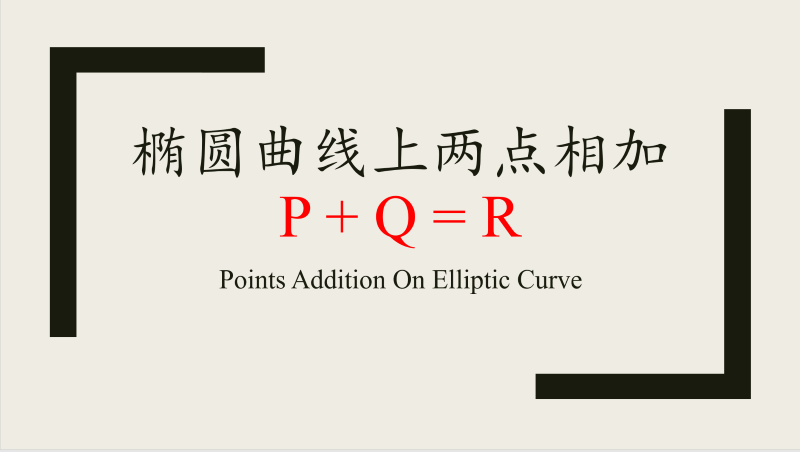
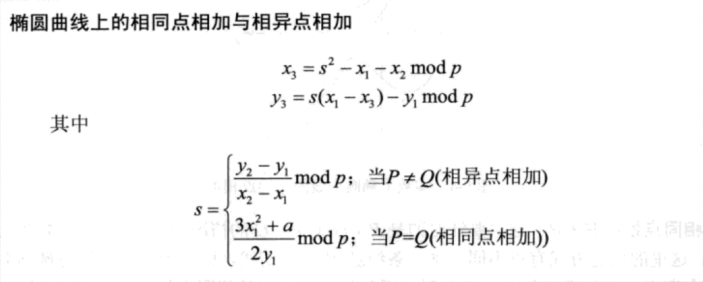
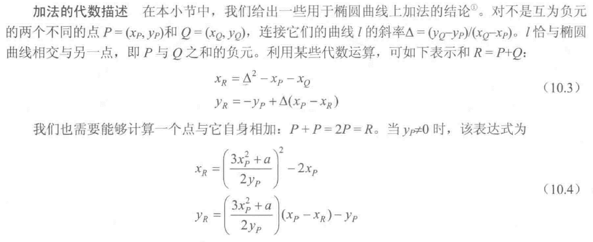
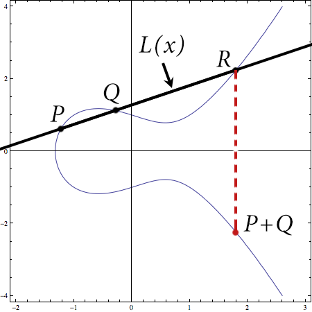

# 椭圆曲线上的相同点与相异点相加的推导计算

[TOC]

## 1. 背景

### 1.1 起因

椭圆曲线密码学(ECC)上要求计算两点`$P, Q$`相加时得到的第三点`$R$`的坐标。

翻阅了《深入浅出密码学》和《密码编码学与网络安全》(第7,8版)，这两本书中都直接给出结论，没有给出推导。

> 1. 《深入浅出密码学》, 第230页
> 
>
> 2. 《密码编码学与网络安全》，第7版，第222页
> 


下面推导实数域上椭圆曲线上的两点相加得到第三点坐标。

### 1.2 背景

实数域上的椭圆曲线:
```math
\tag{1} y^2 = x^3 + ax + b
```

与通过椭圆曲线上`$P$`点的直线`$L(x)$`，相交于另外两点`$Q,\ R$`，如下图所示:



假设 P, Q, R 三点的坐标分别为:`$P(x_1, y_1),\ Q(x_2, y_2),\ R(x_3, -y_3)$`。

> 这里是为了计算`$P+Q$`，即`$R$`的镜像点，因此点`$R$`的坐标为`$(x_3, -y_3)$`。

因此通过`$P(x_1, y_1)$`点的直线方程`$L(x)$`可以表述为:

```math
\tag{2} y = k(x-x_1) + y_1
```

其中，`$k$` 为直线`$L(x)$`的斜率。

## 2. 直线的斜率`$k$`

对于`$P,\ Q$`是相同点或不同点，斜率`$k$`的计算方式不一样。

先从简单的方式说起, `$P,\ Q$` 为不同点。

### 2.1 `$P,\ Q$`为不同点的斜率

`$P,\ Q$`不同的情况下，斜率`$k$`可以通过`$P(x_1, y_1),\ Q(x_2, y_2)$`两点的坐标直接得出:
```math
\tag{3} k=\cfrac{y_2-y_1}{x_2-x_1}
```

### 2.2 `$P,\ Q$`为相同点的斜率

当`$P,\ Q$`是同一点时，直线`$L(x)$`实际上就是经过`$P(x_1,\ y_1)$`点的切线。

根据导数的定义，在可导的前提下，某一点的导数就是经过该点切线的斜率。

因此，对式(1)两边求导，有:
```math
2yy' = 3x^2 + a
```

将上式的左边`$2y$`移到右边有:
```math
y' = \cfrac{3x^2+a}{2y}
```

因此，`$y'$`就是曲线上任意一点切线的斜率，对于`$P(x_1, y_1)$`，经过该点切线的斜率:
```math
\tag{5} k =\cfrac{3x^2_1+a}{2y_1}
```

总结一下:
```math
\tag{6} k = \begin{cases}
\cfrac{y_2-y_1}{x_2-x_1}, & (P \neq Q) \\
\\
\cfrac{3x^2_1+ax}{2y_1}, & (P = Q)
\end{cases}
```

## 3. 第三点`$R(x_3, y_3)$`的坐标

### 3.1 横坐标`$x_3$`的计算

将(2)式带入(1)中可以消去`$y$`，得到只包含`$x$`的等式，然后将等式逐步展开:
```math
\begin{aligned}
(k(x-x_1)+y_1)^2 & = x^3 + ax + b\\
k^2(x-x_1)^2 + 2k(x-x_1)y_1 + {y_1}^2 & = x^3 + ax + b\\
k^2(x^2-2x_1x+{x_1}^2) + 2kxy - 2kx_1y_1 + {y_1}^2 & = x^3 + ax + b\\
k^2x^2-2kx_1x+k^2{x_1}^2 + 2kxy - 2kx_1y_1 + {y_1}^2 & = x^3 + ax + b\\
\end{aligned}
```

将上面最后一个等式左边移项到右边，并合并同类项得到:
```math
x^3 - k^2x^2 + (a+2kx_1-2ky)x + b - (k^2x_1^2+2kx_1y_1-y_1^2) = 0
```

整理一下，有:
```math
\tag{7} x^3 - k^2x^2 + (a+2kx_1-2ky)x + b - (kx_1-y_1)^2 = 0
```

式(7)是一个3次方程，其解对应于直线和椭圆曲线三个交点的横坐标`$x_1,\ x_2,\ x_3$`。

根据韦达定理(Vieta's Formulas)，三次方程`$ax^3 + bx^2 + cx + d = 0$`的三个根`$x_1,\ x_2,\ x_3$`有以下关系:
```math
\begin{aligned}
x_1 + x_2 + x_3 & = -\cfrac{b}{a}\\
x_1x_2 + x_1x_3 + x_2x_3 & = -\cfrac{c}{a}\\
x_1x_2x_3 & = -\cfrac{d}{a}
\end{aligned}
```

对应于式(7)就有:
```math
x_1 + x_2 + x_3 = -\cfrac{b}{a} = -\cfrac{-k^2}{1} = k^2, \ (这里\ a=1,\ b=k^2)
```

即:
```math
\tag{8} x_3 = k^2 - x_1 - x_2
```

> 关于韦达定理(Vieta's Formulas)的证明，参考维基百科: [Vieta's Formulas](https://en.wikipedia.org/wiki/Vieta%27s_formulas)
>
> 韦达定理在二次方程和三次方程简单情形中的展开参考本文第四节。

### 3.2 纵坐标`$y_3$`的计算

相比于横坐标，纵坐标的计算比较简单，直接通过两点`$P(x_1, y_1),\ Q(x_3, -y_3)$`计算斜率就可以得到:

```math
k = \cfrac{y_1 - (-y_3)}{x_1 - x_3}
```

将上式右边的`$x_1 - x_3$`移到左边有:
```math
k(x_1 - x_3) = y_1 + y_3
```

因此:
```math
\tag{9} y_3 = k(x_1 - x_3) - y_1
```

### 3.3 总结一下

实数域中，椭圆曲线上相同点与相异点相加的坐标:

```math
\tag{10} P+Q\ 的坐标\ (x_3, y_3),  \begin{cases}
x_3 = k^2 - x_1 - x_2\\
\\
y_3 = k(x_1 - x_3) - y_1
\end{cases}
```

其中:
```math
\tag{6} k = \begin{cases}
\cfrac{y_2-y_1}{x_2-x_1}, & (P \neq Q) \\
\\
\cfrac{3x^2_1+ax}{2y_1}, & (P = Q)
\end{cases}
```

## 4. 韦达定理(Vieta's Fomulas)及其证明


### 4.1 韦达定理

韦达定理(Vieta's Formulas) 指出了多项式的根与系数之间的关系。

对于一个度(degree)为 `$n$` 的多项式
```math
P(x) = a_nx^n + a_{n-1}x^{n-1} + ... + a_1x + a_0
```

其各个根`$r_1, r_2, ..., r_n$`之间的关系有：
```math
\begin{cases}
r_1 + r_2 + ... + r_{n-1} + r_n = - \cfrac{a_{n-1}}{a_n} \\
(r_1r_2 + r_1r_3 + ... + r_1r_n) + (r_2r_3 + r_2r_4 + ... + r_2r_n) + ... + r_{n-1}r_n = \cfrac{a_{n-2}}{a_n}\\
\ \vdots\\
r_1r_2...r_n = (-1)^n \cfrac{a_0}{a_n}
\end{cases}
```

这个公式太复杂，还是拿二次多项式和三次多项式举例说明比较简单。

### 4.2 二次方程和三次方程的例子

假设`$r_1, r_2$`是二次方程`$ax^2 + bx + c = 0$`的两个根，则有:
```math
r_1 + r_2 = - \cfrac{b}{a}, \ r_1r_2 = \cfrac{c}{a}
```

假设`$r_1, r_2, r_3$`是三次方程`$ax^3 + bx^2 + cx + d = 0$`的三个根，则有:
```math
r_1 + r_2 + r_3 = - \cfrac{b}{a}, \ r_1r_2 + r_1r_3 + r_2r_3 = \cfrac{c}{a}, \ r_1r_2r_3 = - \cfrac{d}{a}
```

### 4.4 韦达定理的简单证明

假定 n 次方程`$a_nx^n + a_{n-1}x^{n-1} + ... + a_1x + a_0 = 0$`的根分别为`$r_1, r_2, ..., r_n$`。

则方程可以写成下面的样式:
```math
a_nx^n + a_{n-1}x^{n-1} + ... + a_1x + a_0 = a_n(x-r_1)(x-r_2)...(x-r_n) = 0
```

#### 4.4.1 二次方程

最简单的二次方程:

```math
f(x) = a_2x^2 + a_1x + a_0 = a_2(x-r_1)(x-r_2) = a_2(x^2 - x(r_1 + r_2) + r_1r_2)
```

对比 x 的同类项系数，有:
```math
a_2 = a_2, a_1 = -a_2(r_1 + r_2), a_0 = a_2(r_1r_2)
```

因此:
```math
r_1 + r_2 = - \cfrac{a_1}{a_2}, \ r_1r_2 = \cfrac{a_0}{a_2}
```

#### 4.4.4 三次方程

三次方程:

```math
\begin{aligned}
f(x) = a_3x^3 + a_2x^2 + a_1x + a_0 & = a_3(x-r_1)(x-r_2)(x-r_3)\\
& = a_3(x^2 -(r_1 + r_2)x + r_1r_2)(x-r_3)\\
& = a_3(x^3 - r_3x^2 + (r_1 + r_2)x^2 + (r_1 + r_2)r_3x + r_1r_2x - r_1r_2r_3)\\
& = a_3(x^3 - (r_1 + r_2 + r_3)x^2 + (r_1r_2 + r_1r_3 + r_2r_3)x - r_1r_2r_3)\\
\end{aligned}
```

对比 x 的同类项系数，有:
```math
a_3 = a_3, \ a_2 = -a_3(r_1 + r_2 + r_3), \ a_1 = a_3(r_1r_2 + r_1r_3 + r_2r_3), \ a_0 = -a_3r_1r_2r_3
```

因此:
```math
r_1 + r_2 + r_3 = - \cfrac{a_2}{a_3}, \ r_1r_2 + r_1r_3 + r_2r_3 = \cfrac{a_1}{a_3}, \ r_1r_2r_3 = -\cfrac{a_0}{a_3}
```

这里和第 3.1 节引用的结果是一样的。


### 5. 其它

洛奇工作中常常会遇到自己不熟悉的问题，这些问题可能并不难，但因为不了解，找不到人帮忙而瞎折腾，往往导致浪费几天甚至更久的时间。

所以我组建了几个微信讨论群(记得微信我说加哪个群，如何加微信见后面)，欢迎一起讨论:
- 一个密码编码学讨论组，主要讨论各种加解密，签名校验等算法，请说明加密码学讨论群。
- 一个Android OTA的讨论组，请说明加Android OTA群。
- 一个git和repo的讨论组，请说明加git和repo群。

在工作之余，洛奇尽量写一些对大家有用的东西，如果洛奇的这篇文章让您有所收获，解决了您一直以来未能解决的问题，不妨赞赏一下洛奇，这也是对洛奇付出的最大鼓励。扫下面的二维码赞赏洛奇，金额随意：


洛奇自己维护了一个公众号“洛奇看世界”，一个很佛系的公众号，不定期瞎逼逼。公号也提供个人联系方式，一些资源，说不定会有意外的收获，详细内容见公号提示。扫下方二维码关注公众号：

